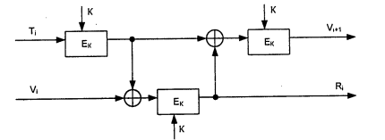

# 16. Генерация криптографических ключей.

Безопасность любого криптографического алгоритма определяется
используемым криптографическим ключом. Добротные криптографические ключи должны иметь достаточную длину и случайные значения битов.

Для получения ключей используются аппаратные и программные средства
генерации случайных значений ключей. Как правило, применяют датчики
псевдослучайных чисел (ПСЧ). Однако степень случайности генерации чисел
должна быть достаточно высокой. Идеальными генераторами являются
устройства на основе "натуральных" случайных процессов, например на
основе белого радиошума.

В телекоммуникационных системах со средними требованиями защищенности вполне приемлемы программные генераторы ключей, которые вычисляют ПСЧ как сложную функцию от текущего времени и (или) числа, введенного пользователем.

Один из методов генерации сеансового ключа для симметричных криптосистем описан в стандарте ANSI X 9.17. Он предполагает использование
криптографического алгоритма DES (хотя можно применить и другие
симметричные алгоритмы шифрования).

Обозначения:

$Е_к(X)$  - результат шифрования алгоритмом DES значения X;

К - ключ, зарезервированный для генерации секретных ключей;

$V_0$ - секретное 64-битовое начальное число;

Т - временная отметка.

Модификация ключа - это генерирование нового ключа из предыдущего значения ключа с помощью односторонней (однонаправленной) функции.
Участники информационного обмена разделяют один и тот же ключ и
одновременно вводят его значение в качестве аргумента в одностороннюю
функцию, получая один и тот же результат. Затем они берут определенные
биты из этих результатов, чтобы создать новое значение ключа.

Процедура модификации ключа работоспособна, но надо помнить, что новый
ключ безопасен в той же мере, в какой был безопасен прежний ключ. Если
злоумышленник сможет добыть прежний ключ, то он сможет выполнить
процедуру модификации ключа.

Генерация ключей для асимметричных криптосистем с открытыми ключами
много сложнее, потому что эти ключи должны обладать определенными
математическими свойствами (они должны быть очень большими и простыми и т.д.).
