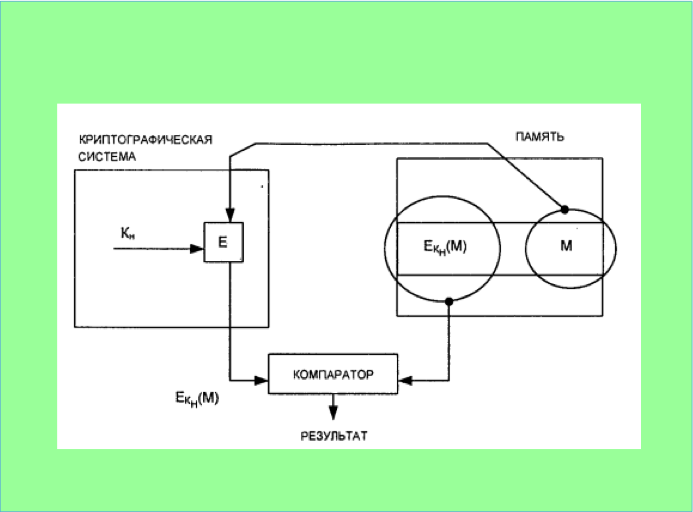
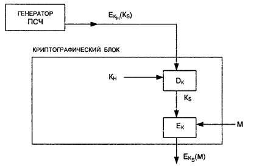

# 17. Хранение криптографических ключей.

Под функцией хранения ключей понимают организацию их безопасного
хранения, учета и удаления. Ключ является самым привлекательным для
злоумышленника объектом, открывающим ему путь к конфиденциальной
информации. Поэтому вопросам безопасного хранения ключей следует уделять особое внимание. Секретные ключи никогда не должны записываться в явном виде на носителе, который может быть считан или скопирован.

2.1 **Носители ключевой информации**

Ключевой носитель может быть технически реализован различным образом на разных носителях информации: магнитных дисках, устройствах хранения
ключей типа Touch Memory, пластиковых картах и т.д.

Магнитные диски представляют собой распространенный тип носителя
ключевой информации. Применение магнитного диска (МД) в качестве
носителя ключа позволяет реализовать необходимое свойство отчуждаемости
носителя ключа от защищенной ком- пьютерной системы, т.е. осуществить
временное изъятие МД из состава технических средств компьютерной
системы. Особенно целесообразно использование в качестве ключевых
носителей съемных накопителей - съемных магнитооптических носителей,
внешних твердотельных запоминающих устройств и т.д.

Устройство хранения ключей типа Touch Memory является относительно новым носителем ключевой информации, предложенным американской компанией Dallas Semiconductor. Носитель информации Touch Memory (ТМ) представляет собой энергонезависимую память, размещенную в металлическом корпусе, с одним сигнальным контактом и одним контактом земли. Корпус ТМ имеет Диаметр 16,25 мм и толщину 3,1 или 5,89 мм (в зависимости от модификации прибора).

Электронные пластиковые карты становятся в настоящее время наиболее
распространенным и универсальным носителем конфиденциальной информации, который позволяет идентифицировать и аутентифицировать пользователей, хранить криптографические ключи, пароли и коды.

Интеллектуальные карты (смарт-карты), обладающие наибольшими
возможностями, не только эффективно применяются для хранения ключевой
информации, но и широко используются в электронных платежных системах, в
комплексных решениях для медицины, транспорта, связи, образования и т.п.

2.2 **Концепция иерархии ключей**

Любая информация об используемых ключах должна быть защищена, в
частности храниться в зашифрованном виде.

Необходимость в хранении и передаче ключей, зашифрованных с помощью
других ключей, приводит к концепции иерархии ключей. В стандарте ISO
8532 (Banking-Key Management) подробно изложен метод главных/сеансовых
ключей (master/session keys). Суть метода состоит в том, что вводится
иерархия ключей: главный ключ (ГК), ключ шифрования ключей (КК), ключ
шифрования данных (КД).

Иерархия ключей может быть:

- двухуровневой (КК/КД);

- трехуровневой (ГК/КК/КД).

Самым нижним уровнем являются рабочие или сеансовые КД, которые
применяются для шифрования данных, персональных идентификационных
номеров (PIN) и аутентификации сообщений.

Когда эти ключи надо зашифровать с целью защиты при передаче или
хранении, используют ключи следующего уровня - ключи шифрования ключей.

Ключи шифрования ключей никогда не должны использоваться как сеансовые
(рабочие) КД, и наоборот.

Такое разделение функций необходимо для обеспечения максимальной
безопасности. Фактически стандарт устанавливает, что различные типы
рабочих ключей (например, для шифрования данных, для аутентификации и
т.д.) должны всегда шифроваться с помощью различных версий ключей
шифрования ключей. В частности, ключи шифрования ключей, используемые
для пересылки ключей между двумя узлами сети, известны также как ключи
обмена между узлами сети (cross domain keys). Обычно в канале используются два ключа для обмена между узлами сети, по одному в каждом направлении. Поэтому каждый узел сети будет иметь ключ отправления для обмена с узлами сети и ключ получения для каждого канала, поддерживаемого другим узлом сети.

На верхнем уровне иерархии ключей располагается главный ключ, мастер-ключ. Этот ключ применяют для шифрования КК, когда требуется сохранить их на диске. Обычно в каждом компьютере используется только один мастер-ключ.

Мастер-ключ распространяется между участниками обмена неэлектронным способом - при личном контакте, чтобы исключить его перехват и/или компрометацию. Раскрытие противником значения мастер-ключа полностью уничтожает защиту телекоммуникационной системы.

Значение мастер-ключа фиксируется на длительное время (до нескольких недель или месяцев). Поэтому генерация и хранение мастер-ключей являются
критическими вопросами криптографической защиты. На практике мастер-ключ компьютера создается истинно случайным выбором из всех возможных значений ключей. Мастер- ключ помещают в защищенный от считывания и
записи и от механических воздействий блок криптографической системы таким образом, чтобы раскрыть значение этого ключа было невозможно. Однако все же должен существовать способ проверки, является ли значение
ключа правильным.

Проблема аутентификации мастер-ключа может быть решена различными
путями. Один из способов аутентификации показан на рис.2 .
Рисунок 2 - Схема аутентификации мастер-ключа хост- компьютера

Схема защиты рабочего (сеансового) ключа показана на рис. 3. Чтобы зашифровать сообщение М ключом K~s~, на соответствующие входы криптографической системы подается криптограмма $Е_{кн}(К_s)$ и сообщение М. Криптографическая система сначала восстанавливает ключ K~s~, а затем шифрует сообщение М, используя открытую форму сеансового ключа $K_s$.

Рисунок 3 - Схема защиты ключа $K_s$

Таким образом, безопасность сеансовых ключей зависит от безопасности криптографической системы. Криптографический блок может быть спроектирован как единая СБИС и помещен в физически защищенное место.

Очень важным условием безопасности информации является периодическое
обновление ключевой информации в телекоммуникационной системе. При этом должны переназначаться как рабочие ключи, так и мастер- ключи. В особо ответственных телекоммуникационных системах обновление ключевой информации (сеансовых ключей) желательно делать ежедневно. Вопрос обновления ключевой информации тесно связан с третьим элементом управления ключами - распределением ключей.
