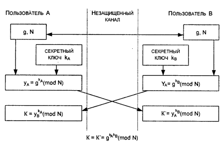

18. Распределение криптографических ключей.**

Распределение ключей это самый ответственный процесс в управлении ключами. К нему предъявляются следующие требования:

- оперативность и точность распределения;

- скрытность распрёделяемых ключей.

Распределение ключей между пользователями компьютерной сети реализуется
двумя способами:

1) использованием одного или нескольких центров распределения ключей;

2) прямым обменом сеансовыми ключами между пользователями сети.

Недостаток первого подхода состоит в том, что центру распределения ключей известно, кому и какие ключи распределены, и это позволяет читать все сообщения, передаваемые по сети. Возможные злоупотребления существенно влияют на защиту.

При втором подходе проблема состоит в том, чтобы надежно удостоверить подлинность субъектов сети.

В обоих случаях должна быть обеспечена подлинность сеанса связи. Это можно осуществить, используя механизм запроса-ответа или механизм отметки времени.

Механизм запроса-ответа заключается в следующем. Пользователь А включает в посылаемое сообщение (запрос) для пользователя В непредсказуемый элемент (например, случайное число). При ответе пользователь В должен выполнить некоторую операцию с этим элементом (например, добавить единицу), что невозможно осуществить заранее, поскольку неизвестно, какое случайное число придет в запросе. После получения результата действий пользователя В (ответ) пользователь А может быть уверен, что сеанс является подлинным.

Механизм отметки времени предполагает фиксацию времени для каждого сообщения. Это позволяет каждому субъекту сети определить, насколько старо пришедшее сообщение, и отвергнуть его, если появится сомнение в его подлинности. При использовании отметок времени необходимо установить допустимый временной интервал задержки.

В обоих случаях для защиты элемента контроля используют шифрование, чтобы быть уверенным, что ответ отправлен не злоумышленником и не изменен штемпель отметки времени.

Задача распределения ключей сводится к построению протокола распределения ключей, обеспечивающего:

- взаимное подтверждение подлинности участников сеанса;

- подтверждение достоверности сеанса механизмом запроса- ответа или
  отметки времени;

- использование минимального числа сообщений при обмене ключами;

- возможность исключения злоупотреблений со стороны центра распределения ключей (вплоть до отказа от него).

В основу решения задачи распределения ключей целесообразно положить принцип отделения процедуры подтверждения подлинности партнеров от процедуры собственно распределения ключей. Цель такого подхода состоит в создании метода, при котором после установления подлинности участники сами формируют сеансовый ключ без участия центра распределения ключей с тем, чтобы распределитель ключей не имел возможности выявить содержание сообщений.

3.1 **Распределение ключей с участием центра распределения ключей**

При распределении ключей между участниками предстоящего информационного обмена должна быть гарантирована подлинность сеанса связи. Для взаимной проверки подлинности партнеров приемлема модель рукопожатия: В этом случае ни один из участников не будет получать никакой секретной информации во время процедуры установления подлинности.

Взаимное установление подлинности гарантирует вызов нужного субъекта с высокой степенью уверенности, что связь установлена с требуемым адресатом и никаких попыток подмены не было. Реальная процедура организации соединения между участниками информационного обмена включает как этап распределения, так и этап подтверждения подлинности партнеров.

При включении в процесс распределения ключей центра распределения ключей (ЦРК) осуществляется его взаимодействие с одним или обоими участниками сеанса с целью распределения секретных или открытых ключей, предназначенных для использования в последующих сеансах связи.

Следующий этап-подтверждение подлинности участников содержит обмен удостоверяющими сообщениями, чтобы иметь возможность выявить любую подмену или повтор одного из предыдущих вызовов.

Рассмотрим протоколы для симметричных криптосистем с секретными ключами и для асимметричных криптосистем с открытыми ключами. Вызывающий (исходный объект) обозначается через А, а вызываемый (объект назначения) через В. Участники сеанса А и В имеют уникальные идентификаторы $Id_A$ и $Id_B$ соответственно.

Протокол аутентификации и распределения ключей для симметричных криптосистем. Рассмотрим в качестве примера протокол аутентификации и распределения ключей Kerberos (по- русски - Цербер). Первоначально протокол Kerberos был разработан в Массачусетском технологическом институте (США) для проекта Athena. Протокол Kerberos спроектирован для работы в сетях TCP/IP и предполагает участие в аутентификации и распределении ключей третьей доверенной стороны. Kerberos обеспечивает надежную аутентификацию в сети, разрешая законному пользователю доступ к различным машинам в сети. Протокол Kerberos основывается на симметричной криптографии (реализован алгоритм DES, хотя возможно применение и других симметричных криптоалгоритмов). Kerberos разделяет отдельный секретный ключ с каждым субъектом сети. Знание такого секретного ключа равносильно доказательству подлинности субъекта сети.

Рисунок 4 - Схема и шаги протокола Kerberos

Обозначения:

KS - сервер системы Kerberos
AS - сервер идентификации
TGS - сервер выдачи разрешений
RS - сервер информационных ресурсов
С - клиент системы Kerberos
1 : С →AS: - запрос разрешить обратиться к TGS
2 : AS → С: - разрешение обратиться к TGS
3 : С →TGS: - запрос на допуск к RS
4 : TGS →С: - разрешение на допуск к RS
5 : С → RS: - запрос на получение информационного ресурса от RS

6 : RS →С: -подтверждение подлинности сервера RS и предоставление информационного ресурса

Протокол для асимметричных криптосистем с использованием сертификатов
открытых ключей.

В этом протоколе используется идея сертификатов открытых ключей.

Сертификатом открытого ключа С называется сообщение ЦРК, удостоверяющее целостность некоторого открытого ключа объекта. Например, сертификат открытого ключа для пользователя обозначаемый $С_А$, содержит отметку времени Т, идентификатор $Id_A$ и открытый ключ $К_А$, зашифрованные секретным ключом $ЦРК~k_{црк}$, т. е.

СА = $Е_{k\ црк}~ (Т, Id_A, К_А)$.
Отметка времени Т используется для подтверждения актуальности сертификата и тем самым предотвращает повторы прежних сертификатов, которые содержат открытые ключи и для которых соответствующие секретные ключи несостоятельны.

Секретный ключ $k_{црк}$~ известен только менеджеру ЦРК. Открытый ключ
$k_{црк}~$ известен участникам А и В. ЦРК поддерживает таблицу открытых
ключей всех объектов сети, которые он обслуживает.

Вызывающий объект А инициирует стадию установления ключа, запрашивая у
ЦРК сертификат своего открытого ключа и открытого ключа участника В:

А → ЦРК: I$d_A$, $Id_B$, (5)
"Вышлите сертификаты ключей А и В'»
Здесь $Id_A$ и $Id+B$- уникальные идентификаторы соответственно участников А и В.

Менеджер ЦРК отвечает сообщением ЦРК →А: $Е_{kцрк}~ (Т, Id_A, К_А~ Е_{kцрк}~ (Т, Id_B, К_В)$. (6)

Участник А, используя открытый ключ ЦРК kцрк, расшифровывает ответ ЦРК, проверяет оба сертификата. Идентификатор Id~B~ убеждает А, что личность вызываемого участника правильно зафиксирована в ЦРК и $К_В$ - действительно открытый ключ участника поскольку оба зашифрованы ключом
$k_{црк}$~.

Хотя открытые ключи предполагаются известными всем, посредничество ЦРК
позволяет подтвердить их целостность.

Следующий шаг протокола включает установление связи А с В: отметка времени, зашифрованная секретным ключом участника А и являющаяся подписью участника А, поскольку никто другой не может создать такую подпись; $r_i$~ -случайное число, генерируемое А и используемое для обмена с В в ходе процедуры подлинности.

Если сертификат С~А~ и подпись А верны, то участник В уверен, что сообщение пришло от А. Часть сообщения $E_{kB}~(r_i~)$ может расшифровать только В, поскольку никто другой не знает секретного ключа$k_B~$, соответствующего открытому ключу K~B~. Участник В расшифровывает
значение числа $r_i$, и, чтобы подтвердить свою подлинность, посылает
участнику А сообщение

В →A: E~kA~(r~i~).\
Участник А восстанавливает значение $r_i$, расшифровывая это

сообщение с использованием своего секретного ключа k~A~. Если это
ожидаемое значение r~i~, то А получает подтверждение, что вызываемый
участник действительно В.

А →В: С~А~, Е~kA~(Т), E~kB~(r~i~).\
Здесь СА-сертификат открытого ключа пользователя А; Е~kA~(Т)- отметка
времени, зашифрованная секретным ключом участника А и являющаяся
подписью участника А, поскольку никто другой не может создать такую
подпись; r~i~ -случайное число, генерируемое А и используемое для обмена
с В в ходе процедуры подлинности.

Если сертификат С~А~ и подпись А верны, то участник В уверен, что
сообщение пришло от А. Часть сообщения E~kB~(r~i~) может расшифровать
только В, поскольку никто другой не знает секретного ключа k~B~,
соответствующего открытому ключу K~B~. Участник В расшифровывает
значение числа ri, и, чтобы подтвердить свою подлинность, посылает
участнику А сообщение

В →A: E~kA~(r~i~).\
Участник А восстанавливает значение r~i~, расшифровывая это

сообщение с использованием своего секретного ключа k~A~. Если это
ожидаемое значение r~i~, то А получает подтверждение, что вызываемый
участник действительно В.

3.2 **Прямой обмен ключами между пользователями**

При использовании для информационного обмена криптосистемы с
симметричным секретным ключом два пользователя, желающие обменяться
криптографически защищенной информацией, должны обладать общим секретным
ключом. Пользователи должны обменяться общим ключом по каналу связи
безопасным образом. Если пользователи меняют ключ достаточно часто, то
доставка ключа превращается в серьезную проблему.

Для решения этой проблемы можно применить два способа:

1\) использование криптосистемы с открытым ключом для шифрования и
передачи секретного ключа симметричной криптосистемы;

2\) использование системы открытого распределения ключей Диффи-Хеллмана.

Алгоритм открытого распределения ключей Диффи- Хеллмана.

Алгоритм Диффи-Хеллмана был первым алгоритмом с открытыми ключами
(предложен в 1976 г.). Его безопасность обусловлена трудностью
вычисления дискретных логарифмов в конечном поле, в отличие от легкости
дискретного возведения в степень в том же конечном поле.

Рисунок 5 - Схема реализации алгоритма Диффи-Хеллмана

Преимущество метода Диффи-Хеллмана по сравнению с методом RSA
заключается в том, что формирование общего секретного ключа происходит в
сотни раз быстрее. В системе RSA генерация новых секретных и открытых
ключей основана на генерации новых простых чисел, что занимает много
времени.

Протокол SKIP управления криптоключами. Протокол SKIP (Simple Key
management for Internet Protocol) может использоваться в качестве
интегрирующей среды и системы управления криптоключами.

Протокол SKIP базируется на криптографии открытых ключей Диффи-Хеллмана
и обладает рядом достоинств:

- обеспечивает высокую степень защиты информации;

- обеспечивает быструю смену ключей;

- поддерживает групповые рассылки защищенных сообщений;

- допускает модульную замену систем шифрования;

- вносит минимальную избыточность.
