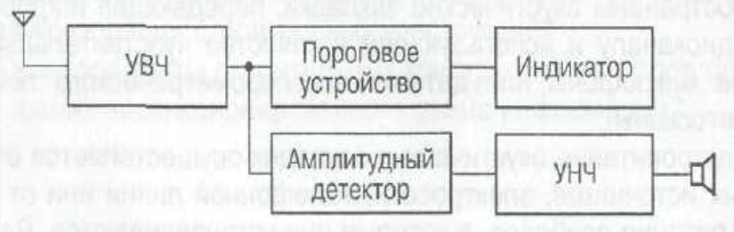

# 7. Средства обнаружения каналов утечки информации в телекоммуникационных системах.

Индикатор электромагнитных излучений позволяет регистрировать
электромагнитные излучения в зоне контроля.

Индикаторы электромагнитного поля характеризуются следующими
показателями:

- рабочий диапазон частот;\
- чувствительность;\
- радиус обнаружения закладки с установленной мощностью
радиопередатчика;\
- тип источника питания и время автономной работы в режимах поиска
закладок;\
- пределы регулирования порога чувствительности, методы ее повышения;\
- наличие режима «акустической завязки»;\
- тип индикации;\
- возможность прослушивания информации, передаваемой радиозакладкой;\
- габариты, масса, конструкция.

Единственной функцией **малогабаритных индикаторов** поля является
включение индикации при превышении уровнем электромагнитного поля
некоторого ранее установленного значения (порога). Индикация таких
приборов, как правило, имеет смысл - Да/Нет.

**Профессиональные индикаторы** предназначены для проведения поисковых
мероприятий, для поиска и локализации источников электромагнитных
излучений. Обладают высокими техническими характеристиками, широкими
функциональными возможностями. Имеют режим акустической завязки,
регулятор чувствительности, полосовые фильтры, обладают высокой
чувствительностью, некоторые имеют возможность измерения частоты.
Позволяют измерять уровень сигнала, находящегося в ближней зоне, имеют
тональную индикацию уровня сигнала (тепло/холодно). Обладают наибольшими
преимуществами по сравнению с остальными типами индикаторов поля.
Недостатком является высокая цена.

**Камуфлированные индикаторы** предназначены для неявного применения. Их
основной особенностью является то, что эти приборы выполнены в виде
обычных предметов, которые применяются в повседневной деятельности с
сохранением их основных возможностей. Использование таких индикаторов не
вызывает подозрения. Они обладают хорошими техническими
характеристиками, высокой чувствительностью.

**Радиочастотометры** регистрируют превышение порога по частоте. Поиск
устройств съема осуществляется путем планомерного обхода помещения с
радиочастотометром. При обходе помещения антенну необходимо
ориентировать в разных плоскостях, при этом расстояние от антенны до
обследуемых объектов должно быть 5-20 см. Возможное месторасположение
закладки определяется по максимальному уровню сигнала в определенной
точке пространства обследуемого помещения. При обнаружении излучения на
дисплее высвечивается частота принимаемого сигнала, происходит звуковое
или световое оповещение. Так же, как индикаторы поля и
радиочастотометры, сканирующие приемники могут применяться в целях
контроля.

**Сканирующие приемники** делятся на перевозимые и переносимые.
Существует множество алгоритмов сканирования, основные из которых
приведены ниже:

- сканирование прекращается, если уровень принимаемого сигнала превышает
заданный порог. Происходит звуковое или световое оповещение оператора.
Возобновление сканирования осуществляется только по его команде;\
- сканирование прекращается при обнаружении сигнала и возобновляется
после его пропадания;\
- сканирование прекращается при анализе сигнала оператором и
продолжается через некоторое время;\
- ручное сканирование. В данном режиме настройка приемника
осуществляется оператором вручную.

Комплект сканирующий приемник совместно с ПЭВМ (со специальным
программным обеспечением) является простейшим примером
**автоматизированного поискового комплекса** (далее АПК). Более сложные
системы построены также на базе ПЭВМ и сканирующего приемника, но имеют
дополнительные блоки, повышающие быстродействие и расширяющие
функциональные возможности комплекса. Малый вес и сравнительно небольшие
размеры современных комплексов, а также универсальное питание (12, 220 В
или аккумуляторные батареи), позволяют работать с ними в разных
условиях: в стационарных и \"полевых\".

В отдельную группу выделяют так называемые **специальные поисковые
программно-аппартные комплексы**, например, РК 855-S, OSCOR OSC-5000
DeLuxe, Scanlock Select Plus. Они предназначены для автоматического
поиска радиозакладок. Комплексы имеют в своем составе специальный
сканирующий приемник, микропроцессор и генератор тестового акустического
сигнала или бесшумный коррелятор. Основной характеристикой таких
комплексов является производительность -- скорость анализа
радиодиапазона с учетом времени, которое комплекс затрачивает на
отнесение обнаруженного сигнала к классу сигналов радиозакладных
устройств.

Для выявления внедренных устройств перехвата информации как объектов,
имеющих определенные физические свойства (габариты, массу, структуру,
состав) используется так называемая досмотровая техника.

В основу работы **нелинейных локаторов** как средства обнаружения ТКУИ
положено свойство электропроводящих материалов отражать радиоволны. Этим
свойством в полной мере обладают средства перехвата информации.

Поскольку для обнаружения радиозакладок используются нелинейные свойства
полупроводниковых элементов, приборы назвали нелинейными локаторами. В
состав нелинейного локатора входят: передатчик, приемник, приемно-
передающая антенна, устройства индикации. Принцип действия следующий.
Любые радиозакладки содержат в своей схеме полупроводниковые элементы
(диоды, транзисторы, микросхемы), которые для локатора являются
отражателями. В результате облучения радиозакладки зондирующим сигналом
локатора в ней наводится переменная ЭДС, которая преобразуется
нелинейными элементами в выскокочастотные сигналы кратных частот,
переизлучаемые в пространство. Этот переизлученный закладкой сигнал
поступает на вход локатора. По наличию в спектре принимаемого локатором
сигнала высших гармоник частоты собственного передатчика делается вывод
о наличии закладки в помещении.

В основе работы **металлодетектора** лежит принцип вихревого контроля,
который заключается в анализе взаимодействия внешнего ЭМ-поля с ЭМ-
полем вихревых токов, наводящихся в токопроводящих элементах закладки. В
качестве источника ЭМ-поля чаще всего используется индуктивная катушка,
называемая вихревым преобразователем. В качестве досмотровой техники
выступают также тепловизоры. Действие тепловизоров основано на
следующем. При размещении закладки в окружающей среде возникает
нарушение структуры, в частности, плотности среды. В результате
возникает различие в степени теплового излучения маскирующего слоя,
расположенного над закладкой, и естественного фона. Уровень излучения
зависит от материала, влажности, температуры, состояния поверхности
маскирующего слоя и других факторов.

Для визуального осмотра
труднодоступных зон, характеризуемых минимальным размером входных
отверстий, сложным строением и плохой освещенностью, предназначены
волоконно-оптические приборы -- **эндоскопы**. В состав стандартного
прибора входят: мощный источник света, световод освещения, световод
изображения, окуляр с регулятором резкости, манипулятор гибкого участка
рабочей части световода. В качестве источника света используется
галогенная лампа, снабженная отражателем с интерференционным покрытием.

По световоду освещения свет передается в труднодоступную зону осмотра.
Изображение, увеличенное объективом, передается по световоду изображения
оператору. Качество изображения устанавливается регулятором резкости. В
целях контроля применяют также **рентгеновские комплексы**.
Рентгеновское излучение представляет собой электромагнитное излучение,
состоящее из незаряженных частиц- фотонов. В целях обнаружения закладных
устройств интерес представляет только \"тормозное\" излучение --
излучение, возникающее в рентгеновской трубке при ударе о закладку
свободных электронов, ускоренных до высоких энергий. \"Тормозное\"
излучение несет информацию о внутреннем строении, то есть образует
рентгеновское изображение закладки, которое впоследствии преобразуется в
оптическое. 

**Анализатор проводных линий** предназначен для обследования
проводных линий на наличие несанкционированных подключений, для
обнаружения и анализа сигналов в проводных линиях и в подключенных к ним
электронных устройствах, для проверки электронной аппаратуры,
подключенной к проводным линиям, на наличие эффекта акустоэлектрического
преобразования и эффекта формирования модуляции в высокочастотном
сигнале навязывания.
