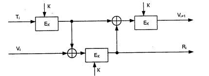
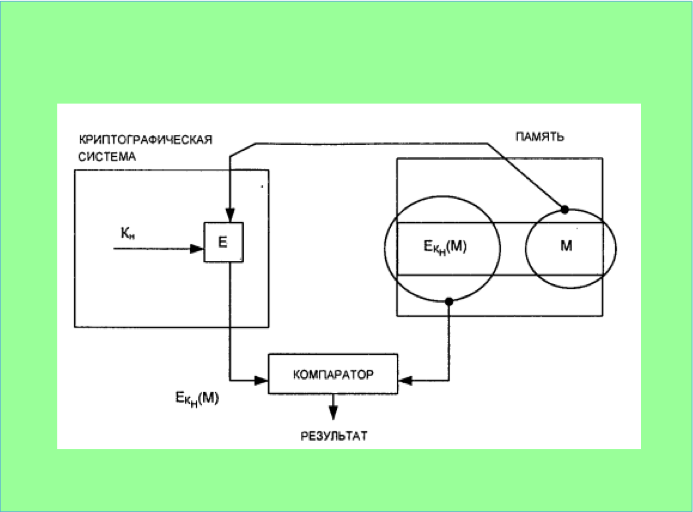
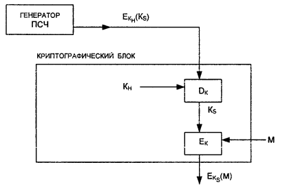

***ИБАТС***

***Теоретические вопросы***

# Оглавление {#оглавление .TOC-Heading}

[1. Структура дисциплины «Информационная безопасность автоматизированных
и телекоммуникационных систем». Основные понятия и определения,
используемые в дисциплине.](1.md/)

[2. Цели и задачи концепции национальной безопасности Российской
Федерации.
6](#цели-и-задачи-концепции-национальной-безопасности-российской-федерации.)

[3. Виды представления информации в телекоммуникационных системах и
возможные каналы ее утечки.
7](#виды-представления-информации-в-телекоммуникационных-системах-и-возможные-каналы-ее-утечки.)

[4. Уязвимости информации в телекоммуникационных системах.
7](#уязвимости-информации-в-телекоммуникационных-системах.)

[5. Угрозы информационной безопасности телекоммуникационных систем.
8](#угрозы-информационной-безопасности-телекоммуникационных-систем.)

[6. Каналы утечки информации в телекоммуникационных системах.
10](#каналы-утечки-информации-в-телекоммуникационных-системах.)

[7. Средства обнаружения каналов утечки информации в
телекоммуникационных системах.
12](#средства-обнаружения-каналов-утечки-информации-в-телекоммуникационных-системах.)

[8. Способы несанкционированного доступа к конфиденциальной информации в
проводных телекоммуникационных системах.
16](#способы-несанкционированного-доступа-к-конфиденциальной-информации-в-проводных-телекоммуникационных-системах.)

[9. Способы несанкционированного доступа к конфиденциальной информации в
беспроводных телекоммуникационных системах и сетях.
16](#способы-несанкционированного-доступа-к-конфиденциальной-информации-в-беспроводных-телекоммуникационных-системах-и-сетях.)

[11. Методы защиты информации в телекоммуникационных системах.
17](#_Toc100004858)

[12. Классификация средств криптографической защиты информации и
требования, предъявляемые к ним.
18](#классификация-средств-криптографической-защиты-информации-и-требования-предъявляемые-к-ним.)

[13. Аппаратные средства криптографической защиты информации.
19](#аппаратные-средства-криптографической-защиты-информации.)

[14. Программные средства криптографической защиты информации.
19](#_Toc100004861)

[16. Генерация криптографических ключей.
21](#генерация-криптографических-ключеи.)

[17. Хранение криптографических ключей.
22](#хранение-криптографических-ключеи.)

[19. Контроль состояния защиты информации.
31](#контроль-состояния-защиты-информации.)

[20. Лицензирование деятельности по обеспечению безопасности информации
в телекоммуникационных системах.
32](#лицензирование-деятельности-по-обеспечению-безопасности-информации-в-телекоммуникационных-системах.)

[21. Сертификация средств защиты и аттестация объектов информатизации.
34](#сертификация-средств-защиты-и-аттестация-объектов-информатизации.)

[22. Система аттестации объектов информатизации РФ. Органы аттестации.
37](#система-аттестации-объектов-информатизации-рф.-органы-аттестации.)

[23. Этапы аттестации объектов информатизации по требованиям
безопасности информации.
38](#этапы-аттестации-объектов-информатизации-по-требованиям-безопасности-информации.)

[24. Специальная проверка компонентов автоматизированной системы.
39](#специальная-проверка-компонентов-автоматизированнои-системы.)

[25. Специальные обследования выделенных помещений, предназначенных для
размещения телекоммуникационных систем.
39](#специальные-обследования-выделенных-помещении-предназначенных-для-размещения-телекоммуникационных-систем.)

[26.Специальные исследования. 39](#специальные-исследования.)

[27.Особенности защиты информации при авариях и иных экстремальных
ситуациях.
39](#особенности-защиты-информации-при-авариях-и-иных-экстремальных-ситуациях.)

[28. Государственная система защиты информации в Российской Федерации.
39](#государственная-система-защиты-информации-в-россиискои-федерации.)

[29. Организация деятельности по защите информации в
телекоммуникационных системах.
39](#организация-деятельности-по-защите-информации-в-телекоммуникационных-системах.)

[30. Требования по защите конфиденциальной речевой информации и каналы
ее утечки.
39](#требования-по-защите-конфиденциальнои-речевои-информации-и-каналы-ее-утечки.)

[31. Рекомендации по защите конфиденциальной речевой информации.
39](#рекомендации-по-защите-конфиденциальнои-речевои-информации.)

[32. Защита речевой информации при её передаче по каналам связи.
39](#защита-речевой-информации-при-её-передаче-по-каналам-связи.)

[33. Аутентификация пользователей в беспроводных локальных сетях.
40](#аутентификация-пользователей-в-беспроводных-локальных-сетях.)

[34. Комплексная система обеспечения безопасности беспроводных сетей.
40](#комплексная-система-обеспечения-безопасности-беспроводных-сетей.)

[35. Аутентификация по стандарту IEEE 802.1x/EAP.
41](#аутентификация-по-стандарту-ieee-802.1xeap.)

[36. Системы обнаружения вторжения в беспроводных сетях.
42](#системы-обнаружения-вторжения-в-беспроводных-сетях.)

[37. Угрозы и методы обеспечения информационной безопасности в цифровых
узлах коммутации.
43](#угрозы-и-методы-обеспечения-информационной-безопасности-в-цифровых-узлах-коммутации.)

[38.Угрозы и методы обеспечения информационной безопасности в сети
общеканальной сигнализации ОКС-7.
45](#угрозы-и-методы-обеспечения-информационной-безопасности-в-сети-общеканальной-сигнализации-окс-7.)

[39. Угрозы и методы обеспечения информационной безопасности VoIP сетей.
47](#угрозы-и-методы-обеспечения-информационной-безопасности-voip-сетей.)

[40. Структура и классификация автоматизированных информационных систем.
49](#структура-и-классификация-автоматизированных-информационных-систем.)

[41. Угрозы информационной безопасности автоматизированных систем.
50](#угрозы-информационной-безопасности-автоматизированных-систем.)

[42. Административный уровень обеспечения информационной безопасности.
50](#административный-уровень-обеспечения-информационной-безопасности.)

[43. Процедурный уровень обеспечения информационной безопасности.
51](#процедурный-уровень-обеспечения-информационной-безопасности.)

[44. Программно-технический уровень обеспечения информационной
безопасности.
52](#программно-технический-уровень-обеспечения-информационной-безопасности.)

[45. Основные понятия в области доступности данных.
53](#основные-понятия-в-области-доступности-данных.)

[46. Обеспечение отказоустойчивости автоматизированных систем.
53](#обеспечение-отказоустойчивости-автоматизированных-систем.)

[47. Обеспечение обслуживаемости автоматизированных систем.
54](#обеспечение-обслуживаемости-автоматизированных-систем.)

[48. Экранирование и межсетевые экраны.
54](#экранирование-и-межсетевые-экраны.)

[49. Принципы работы межсетевых экранов.
55](#принципы-работы-межсетевых-экранов.)

[50. Классификация межсетевых экранов.
55](#классификация-межсетевых-экранов.)

[51. Пакетные фильтры. 56](#пакетные-фильтры.)

[52. Сервера уровня соединения. 57](#сервера-уровня-соединения.)

[53. Сервера прикладного уровня 58](#сервера-прикладного-уровня)

[54. Хэш-функции, понятие, свойства, классификация.
58](#хэш-функции-понятие-свойства-классификация.)

[55. Хэш-функция MD5. Понятие и алгоритм получения.
59](#хэш-функция-md5.-понятие-и-алгоритм-получения.)

[56. Хэш-функции семейства SHA. Понятие и алгоритм получения.
60](#хэш-функции-семейства-sha.-понятие-и-алгоритм-получения.)

[57. Коды аутентификации сообщений -- МАС.
60](#коды-аутентификации-сообщений-мас.)

[58. Электронная цифровая подпись. Понятие и алгоритм реализации.
60](#электронная-цифровая-подпись.-понятие-и-алгоритм-реализации.)

[59. Стандарт цифровой подписи DSS. Создание и проверка подписи с
помощью стандарта DSS.
60](#стандарт-цифровой-подписи-dss.-создание-и-проверка-подписи-с-помощью-стандарта-dss.)

[60. Общая характеристика стандарта цифровой подписи ГОСТ 34.10- 2018
«Межгосударственный стандарт. Информационная технология.
Криптографическая защита информации. Процессы формирования и проверки
электронной цифровой подписи».
60](#общая-характеристика-стандарта-цифровой-подписи-гост-34.10--2018-межгосударственный-стандарт.-информационная-технология.-криптографическая-защита-информации.-процессы-формирования-и-проверки-электронной-цифровой-подписи.)

[61. Определение и содержание регистрации и аудита информационных
систем.
60](#определение-и-содержание-регистрации-и-аудита-информационных-систем.)

[62. Этапы регистрации и методы аудита событий информационной системы.
60](#этапы-регистрации-и-методы-аудита-событий-информационной-системы.)

[63. Технология виртуальных частных сетей.
60](#технология-виртуальных-частных-сетей.)

[64. Сущность и содержание технологии виртуальных частных сетей.
60](#сущность-и-содержание-технологии-виртуальных-частных-сетей.)

[65. Понятие \"туннеля\" при передаче данных в сетях.
60](#понятие-туннеля-при-передаче-данных-в-сетях.)

[66. Назначение протокола SSL при поддержании безопасности связи и его
свойства.
60](#назначение-протокола-ssl-при-поддержании-безопасности-связи-и-его-свойства.)

[67. Назначение протокола Secure Shell (SSH) при поддержании
безопасности связи, структура и его свойства.
60](#назначение-протокола-secure-shell-ssh-при-поддержании-безопасности-связи-структура-и-его-свойства.)

[68. Назначение протокола HTTP при поддержании безопасности связи и его
свойства.
60](#назначение-протокола-http-при-поддержании-безопасности-связи-и-его-свойства.)

[69. Назначение протокола SOCKS при поддержании безопасности связи и его
свойства.
60](#назначение-протокола-socks-при-поддержании-безопасности-связи-и-его-свойства.)

[70. Назначение протокола IPSec при поддержании безопасности связи и его
свойства.
60](#назначение-протокола-ipsec-при-поддержании-безопасности-связи-и-его-свойства.)

[71. Назначение стандарта Х.509 при поддержании безопасности связи и его
свойства.
60](#назначение-стандарта-х.509-при-поддержании-безопасности-связи-и-его-свойства.)

[72. Технологии удаленного доступа к виртуальным частным сетям.
60](#технологии-удаленного-доступа-к-виртуальным-частным-сетям.)


# 2. Цели и задачи концепции национальной безопасности Российской Федерации.

Согласно официально принятым в Российской Федерации взглядам под
безопасностью понимается состояние защищенности жизненно важных
интересов личности, общества и государства от внутренних и внешних
угроз. К основным объектам безопасности относятся:

• личность, ее права и свободы;\
• общество, его материальные и духовные ценности;\
• государство, его конституционный строй, суверенитет, территориальная
целостность.

Все эти объекты безопасности органически взаимосвязаны, и главным
связующим звеном между ними является личность. Защита ее жизни и
здоровья, прав и свобод, достоинства и имущества имеет первостепенное
значение по сравнению с другими видами безопасности.

Под субъектами обеспечения безопасности понимаются участники этого
процесса, способные действовать самостоятельно и свободно. Основным
субъектом обеспечения безопасности является государство, осуществляющее
функции в этой области через органы законодательной, исполнительной и
судебной властей.

# 3. Виды представления информации в телекоммуникационных системах и возможные каналы ее утечки.

В современных автоматизированных ТКС информация может циркулировать в
виде речи, в виде текста или графических изображений на бумаге, фото- и
кинопленке, проекционных экранах, в том числе мониторах ЭВМ, и т.д., в
виде изменений состояния носителей информации, например магнитных дисков
и дискет, магнитных лент, перфокарт и т.д., а также в виде электрических
сигналов в технических средствах, обрабатывающих, хранящих или
передающих конфиденциальную информацию, и в соединяющих их линиях связи.
Различают следующие виды представления информации:

\- документальная;\
- речевая;\
- телекоммуникационная.

Основные каналы утечки информации в ТКС рассматриваются с учетом
физических полей:

\- утечка по акустическому каналу;\
- утечка по виброакустическому каналу;\
- утечка по каналам проводной и радиосвязи, не имеющим шифрующей и
дешифрирующей аппаратуры;\
- утечка по электромагнитным каналам;\
- утечка через вторичные источники электропитания основных технических
средств за счет неравномерности тока потребления;\
- утечка, возникающая при воздействии электрических, магнитных и
акустических полей опасного сигнала на вспомогательных технических
средствах;\
- утечка за счет тока опасного сигнала в цепях заземления;\
- утечка за счет взаимного влияния между цепями, по которым передается
конфиденциальная информация, и цепями вспомогательных технических
средств, имеющими выход за пределы зоны безопасности объекта другими
словами, использование эффекта индуктивности любых неэкранированных
проводников;\
- утечка информации за счет побочных электромагнитных излучений и
наводок, образованных основными техническими средствами.

# 4. Уязвимости информации в телекоммуникационных системах.

Под уязвимостью телекоммуникационной системы понимается любая
характеристика информационной системы, использование которой нарушителем
при определенных условиях может привести к реализации угрозы.

Таким образом, **уязвимость** - это недостаток телекоммуникационной
системы, предоставляющий возможность реализации угроз безопасности
обрабатываемой информации. Не существует телекоммуникационных систем, не
содержащих уязвимости, существуют только защищенные -- по отношению к
которым вероятность возникновения актуальных угроз безопасности
информации является приемлемой.

**Атака** на телекоммуникационную систему - это действие,
предпринимаемое злоумышленником, которое заключается в поиске и
использовании той или иной её уязвимости.

**Классификация уязвимостей телекоммуникационных систем**

**По этапам жизненного цикла**, на которых они появляются:

• уязвимости этапа проектирования;\
• уязвимости этапа реализации;\
• уязвимости этапа эксплуатации.

**По уровню в информационной инфраструктуры системы**:

• уязвимости уровня сети --- уязвимости сетевых протоколов;\
• уязвимости уровня операционной системы;\
• уязвимости уровня баз данных --- уязвимости конкретных СУБД;\
• уязвимости уровня приложений --- относятся уязвимости\
программного обеспечения.

**По степени риска**:

• высокий уровень риска --- уязвимость позволяет атакующему получить
доступ к узлу с правами администратора в обход средств защиты;\
• средний уровень риска --- уязвимость позволяет атакующему получить
информацию, которая с высокой степенью вероятности позволит получить
доступ к узлу;\
• низкий уровень риска --- уязвимости, позволяющие злоумышленнику
осуществлять сбор критической информации о системе.

# 5. Угрозы информационной безопасности телекоммуникационных систем.

**Угроза** -- это потенциально возможное событие, явление или

процесс, который посредством воздействия на компоненты

информационной системы может привести к нанесению ущерба.

Под **угрозой безопасности информации** будем понимать

возникновение такого явления или события, следствием

которого могут быть негативные воздействия на информацию:

• нарушение физической целостности,

• нарушение логической структуры,

• несанкционированная модификация, несанкционированное

получение,

• несанкционированное размножение.

Наиболее ощутимый ущерб связан с нарушением

конфиденциальности, когда сведения, предназначенные лишь

для определенного круга лиц, попадают в посторонние руки.

**Классификация угроз безопасности телекоммуникационных систем**

**По цели воздействия** различают три основных типа угроз безопасности
ТКС:

• угрозы нарушения конфиденциальности информации;\
• угрозы нарушения целостности информации;\
• угрозы нарушения работоспособности (доступности) системы (отказы в
обслуживании).

**По причине возникновения** многообразие угроз для телекоммуникационных
систем делится на несколько основных видов:

> • Информационные (преднамеренные и случайные);\
> • Аппаратно-программные;\
> • Радиоэлектронные помехи;\
> • Физические поломки;\
> • Организационные и нормативно-правовые.\
> • Угрозы нарушения конфиденциальности направлены на разглашение
> конфиденциальной или секретной информации.\
> • Угрозы нарушения целостности информации, хранящейся в компьютерной
> системе или передаваемой по каналу связи, направлены на ее изменение
> или искажение, приводящее к нарушению ее качества или полному
> уничтожению. Целостность информации может быть нарушена умышленно
> злоумышленником, а также в результате объективных воздействий со
> стороны среды, окружающей систему.\
> • Угрозы нарушения работоспособности (доступности) системы направлены
> на создание таких ситуаций, когда определенные преднамеренные действия
> либо снижают работоспособность ТКС, либо блокируют доступ к некоторым
> ее ресурсам.

**К информационным угрозам** относятся:

• несанкционированный доступ к информационным ресурсам;\
• незаконное копирование данных в информационных системах;\
• хищение информации из библиотек, архивов, банков и баз данных;\
• нарушение технологии обработки информации;\
• противозаконный сбор и использование информации;\
• использование информационного оружия.

**К аппаратно-программным угрозам** относятся:

• использование ошибок и «дыр» в ПО;\
• компьютерные вирусы и вредоносные программы;\
• установка «закладных» устройств.

**К физическим угрозам** относятся:

• уничтожение или разрушение средств обработки информации и связи;\
• хищение носителей информации;\
• хищение программных или аппаратных ключей и средств криптографической
защиты данных;\
• воздействие на персонал.

**К радиоэлектронным угрозам** относятся:

• внедрение электронных устройств перехвата информации в технические
средства и помещения;\
• перехват, расшифровка, подмена и уничтожение информации в каналах
связи.

**К организационным и нормативно-правовым** угрозам относятся:

• закупки несовершенных или устаревших информационных технологий и
средств информатизации;\
• нарушение требований законодательства и задержка в принятии
необходимых нормативно-правовых решений в информационной сфере.

# 6. Каналы утечки информации в телекоммуникационных системах.

При выявлении технических каналов утечки информации ТСПИ необходимо
рассматривать как систему, включающую основное оборудование, оконечные
устройства, соединительные линии (совокупность проводов и кабелей,
прокладываемых между отдельными ТСПИ и их элементами), распределительные
и коммутационные устройства, системы электропитания, системы заземления.

**Основные технические средства и системы (ОТСС)** -- это технические
средства и системы, а также их коммуникации, используемые для обработки,
хранения и передачи конфиденциальной информации (АС различного уровня и
назначения), средства и системы связи и передачи данных, включая
коммуникационное оборудование, используемые для обработки и передачи
конфиденциальной информации.

**Вспомогательные технические средства и системы (ВТСС)** -- это
технические средства и системы, не предназначенные для передачи,
обработки и хранения конфиденциальной информации, размещаемые совместно
с основными техническими средствами и системами или в защищаемых
помещениях.

**Контролируемая зона** - территория (либо здание, группа помещений,
помещение), на которой исключено неконтролируемое пребывание лиц и
транспортных средств, не имеющих постоянного или разового допуска. В
контролируемой зоне посредством проведения технических и режимных
мероприятий должны быть созданы условия, предотвращающие возможность
утечки из нее конфиденциальной информации. Контролируемая зона
определяется руководством организации, исходя из конкретной обстановки в
месте расположения объекта и возможностей использования технических
средств перехвата.

К **электромагнитным** относятся каналы утечки информации, возникающие
за счет различного вида побочных электромагнитных излучений (ПЭМИ)
ТСПИ:\
- излучений элементов ТСПИ;\
- излучений на частотах работы высокочастотных (ВЧ) генераторов ТСПИ;\
- излучений на частотах самовозбуждения усилителей низкой частоты (УНЧ)
ТСПИ.

Электромагнитные излучения элементов ТСПИ. В ТСПИ носителем информации
является электрический ток, параметры которого (амплитуда, частота либо
фаза) изменяются по закону изменения информационного сигнала. При
прохождении электрического тока по токоведущим элементам ТСПИ вокруг них
возникает электрическое и магнитное поля. В силу этого элементы ТСПИ
можно рассматривать как излучатели электромагнитного поля, несущего
информацию.

**Электрические каналы утечки информации** возникают за счет:

-- наводок электромагнитных излучений ТСПИ на соединительные линии ВТСС
и посторонние проводники, выходящие за пределы контролируемой зоны;\
-- просачивания информационных сигналов в линии электропитания и цепи
заземления ТСПИ;\
-- использования закладных устройств.

Наводки электромагнитных излучений ТСПИ возникают при излучении
элементами ТСПИ информационных сигналов, а также при наличии
гальванической связи соединительных линий ТСПИ и посторонних проводников
или линий ВТСС. Уровень наводимых сигналов в значительной степени
зависит от мощности излучаемых сигналов, расстояния до проводников, а
также длины совместного пробега соединительных линий ТСПИ и посторонних
проводников.

Перехват информации возможен путем «высокочастотного облучения» ТСПИ.
При взаимодействии облучающего электромагнитного поля с элементами ТСПИ
происходит переизлучение электромагнитного поля. В ряде случаев это
вторичное излучение имеет модуляцию, обусловленную воздействием
информационного сигнала. Поскольку переизлученное электромагнитное поле
имеет параметры, отличные от облучающего поля, данный **канал утечки
информации** часто называют **параметрическим**.

Для перехвата информации по данному каналу необходимы специальные
высокочастотные генераторы с антеннами, имеющими узкие диаграммы
направленности, и специальные радиоприемные устройства. Некоторые ТСПИ
имеют в своем составе печатающие устройства, для которых можно найти
соответствие между распечатываемым символом и его акустическим образом.
Данный принцип лежит в основе канала утечки информации по
**виброакустическому (вибрационному) каналу**.

В виброакустических (вибрационных) технических каналах утечки информации
акустические сигналы, возникающие при ведении разговоров в выделенном
помещении, при воздействии на строительные конструкции (стены, потолки,
полы, двери, оконные рамы и т.п.) и инженерно-технические коммуникации
(трубы водоснабжения, отопления, канализации, воздуховоды и т.п.)
вызывают в них упругие (вибрационные) колебания, которые и
регистрируются датчиками средства разведки.

# 7. Средства обнаружения каналов утечки информации в телекоммуникационных системах.

Индикатор электромагнитных излучений позволяет регистрировать
электромагнитные излучения в зоне контроля.

{width="6.094142607174104in"
height="1.9279286964129483in"}

Индикаторы электромагнитного поля характеризуются следующими
показателями:

• рабочий диапазон частот;\
• чувствительность;\
• радиус обнаружения закладки с установленной мощностью
радиопередатчика;\
• тип источника питания и время автономной работы в режимах поиска
закладок;\
• пределы регулирования порога чувствительности, методы ее повышения;\
• наличие режима «акустической завязки»;\
• тип индикации;\
• возможность прослушивания информации, передаваемой радиозакладкой;\
• габариты, масса, конструкция.

Единственной функцией **малогабаритных индикаторов** поля является
включение индикации при превышении уровнем электромагнитного поля
некоторого ранее установленного значения (порога). Индикация таких
приборов, как правило, имеет смысл - Да/Нет.

**Профессиональные индикаторы** предназначены для проведения поисковых
мероприятий, для поиска и локализации источников электромагнитных
излучений. Обладают высокими техническими характеристиками, широкими
функциональными возможностями. Имеют режим акустической завязки,
регулятор чувствительности, полосовые фильтры, обладают высокой
чувствительностью, некоторые имеют возможность измерения частоты.
Позволяют измерять уровень сигнала, находящегося в ближней зоне, имеют
тональную индикацию уровня сигнала (тепло/холодно). Обладают наибольшими
преимуществами по сравнению с остальными типами индикаторов поля.
Недостатком является высокая цена.

**Камуфлированные индикаторы** предназначены для неявного применения. Их
основной особенностью является то, что эти приборы выполнены в виде
обычных предметов, которые применяются в повседневной деятельности с
сохранением их основных возможностей. Использование таких индикаторов не
вызывает подозрения. Они обладают хорошими техническими
характеристиками, высокой чувствительностью.

**Радиочастотометры** регистрируют превышение порога по частоте. Поиск
устройств съема осуществляется путем планомерного обхода помещения с
радиочастотометром. При обходе помещения антенну необходимо
ориентировать в разных плоскостях, при этом расстояние от антенны до
обследуемых объектов должно быть 5-20 см. Возможное месторасположение
закладки определяется по максимальному уровню сигнала в определенной
точке пространства обследуемого помещения. При обнаружении излучения на
дисплее высвечивается частота принимаемого сигнала, происходит звуковое
или световое оповещение. Так же, как индикаторы поля и
радиочастотометры, сканирующие приемники могут применяться в целях
контроля.

**Сканирующие приемники** делятся на перевозимые и переносимые.
Существует множество алгоритмов сканирования, основные из которых
приведены ниже:

• сканирование прекращается, если уровень принимаемого сигнала превышает
заданный порог. Происходит звуковое или световое оповещение оператора.
Возобновление сканирования осуществляется только по его команде;\
• сканирование прекращается при обнаружении сигнала и возобновляется
после его пропадания;\
• сканирование прекращается при анализе сигнала оператором и
продолжается через некоторое время;\
• ручное сканирование. В данном режиме настройка приемника
осуществляется оператором вручную.

Комплект сканирующий приемник совместно с ПЭВМ (со специальным
программным обеспечением) является простейшим примером
**автоматизированного поискового комплекса** (далее АПК). Более сложные
системы построены также на базе ПЭВМ и сканирующего приемника, но имеют
дополнительные блоки, повышающие быстродействие и расширяющие
функциональные возможности комплекса. Малый вес и сравнительно небольшие
размеры современных комплексов, а также универсальное питание (12, 220 В
или аккумуляторные батареи), позволяют работать с ними в разных
условиях: в стационарных и \"полевых\".

В отдельную группу выделяют так называемые **специальные поисковые
программно-аппартные комплексы**, например, РК 855-S, OSCOR OSC-5000
DeLuxe, Scanlock Select Plus. Они предназначены для автоматического
поиска радиозакладок. Комплексы имеют в своем составе специальный
сканирующий приемник, микропроцессор и генератор тестового акустического
сигнала или бесшумный коррелятор. Основной характеристикой таких
комплексов является производительность -- скорость анализа
радиодиапазона с учетом времени, которое комплекс затрачивает на
отнесение обнаруженного сигнала к классу сигналов радиозакладных
устройств.

Для выявления внедренных устройств перехвата информации как объектов,
имеющих определенные физические свойства (габариты, массу, структуру,
состав) используется так называемая досмотровая техника.

В основу работы **нелинейных локаторов** как средства обнаружения ТКУИ
положено свойство электропроводящих материалов отражать радиоволны. Этим
свойством в полной мере обладают средства перехвата информации.
Поскольку для обнаружения радиозакладок используются нелинейные свойства
полупроводниковых элементов, приборы назвали нелинейными локаторами. В
состав нелинейного локатора входят: передатчик, приемник, приемно-
передающая антенна, устройства индикации. Принцип действия следующий.
Любые радиозакладки содержат в своей схеме полупроводниковые элементы
(диоды, транзисторы, микросхемы), которые для локатора являются
отражателями. В результате облучения радиозакладки зондирующим сигналом
локатора в ней наводится переменная ЭДС, которая преобразуется
нелинейными элементами в выскокочастотные сигналы кратных частот,
переизлучаемые в пространство. Этот переизлученный закладкой сигнал
поступает на вход локатора. По наличию в спектре принимаемого локатором
сигнала высших гармоник частоты собственного передатчика делается вывод
о наличии закладки в помещении.

В основе работы **металлодетектора** лежит принцип вихревого контроля,
который заключается в анализе взаимодействия внешнего ЭМ-поля с ЭМ-
полем вихревых токов, наводящихся в токопроводящих элементах закладки. В
качестве источника ЭМ-поля чаще всего используется индуктивная катушка,
называемая вихревым преобразователем. В качестве досмотровой техники
выступают также тепловизоры. Действие тепловизоров основано на
следующем. При размещении закладки в окружающей среде возникает
нарушение структуры, в частности, плотности среды. В результате
возникает различие в степени теплового излучения маскирующего слоя,
расположенного над закладкой, и естественного фона. Уровень излучения
зависит от материала, влажности, температуры, состояния поверхности
маскирующего слоя и других факторов. Для визуального осмотра
труднодоступных зон, характеризуемых минимальным размером входных
отверстий, сложным строением и плохой освещенностью, предназначены
волоконно-оптические приборы -- **эндоскопы**. В состав стандартного
прибора входят: мощный источник света, световод освещения, световод
изображения, окуляр с регулятором резкости, манипулятор гибкого участка
рабочей части световода. В качестве источника света используется
галогенная лампа, снабженная отражателем с интерференционным покрытием.
По световоду освещения свет передается в труднодоступную зону осмотра.
Изображение, увеличенное объективом, передается по световоду изображения
оператору. Качество изображения устанавливается регулятором резкости. В
целях контроля применяют также **рентгеновские комплексы**.
Рентгеновское излучение представляет собой электромагнитное излучение,
состоящее из незаряженных частиц- фотонов. В целях обнаружения закладных
устройств интерес представляет только \"тормозное\" излучение --
излучение, возникающее в рентгеновской трубке при ударе о закладку
свободных электронов, ускоренных до высоких энергий. \"Тормозное\"
излучение несет информацию о внутреннем строении, то есть образует
рентгеновское изображение закладки, которое впоследствии преобразуется в
оптическое. **Анализатор проводных линий** предназначен для обследования
проводных линий на наличие несанкционированных подключений, для
обнаружения и анализа сигналов в проводных линиях и в подключенных к ним
электронных устройствах, для проверки электронной аппаратуры,
подключенной к проводным линиям, на наличие эффекта акустоэлектрического
преобразования и эффекта формирования модуляции в высокочастотном
сигнале навязывания.

# 8. Способы несанкционированного доступа к конфиденциальной информации в проводных телекоммуникационных системах.

Существуют три физических способа подключения закладных устройств к
проводным телефонным линиям:

•**контактный (или гальванический способ)** -- информация снимается
путем непосредственного подключения к контролируемой линии. Оно может
быть чисто контактным, с помощью согласующего устройства и с помощью
компенсации падения напряжения;

•**бесконтактный индукционный** -- перехват информации происходит за
счет использования магнитной напряженности поля рассеивания вблизи от
телефонных проводов. При этом способе величина снимаемого сигнала очень
мала и такой датчик реагирует на посторонние помеховые электромагнитные
влияния;

•**бесконтактный емкостной** -- перехват информации происходит за счет
регистрирации электрической составляющей поля рассеивания в
непосредственной близости от телефонных проводов.

#  9. Способы несанкционированного доступа к конфиденциальной информации в беспроводных телекоммуникационных системах и сетях.

В беспроводных сетях используют передачу речи (телефонная сотовая связь)
и передачу компьютерных данных (беспроводные компьютерные сети).

Для прослушивания сотового телефона используют следующие типы
аппаратуры:

•Самодельные устройства, произведенные хакерами и фрикерами с
использованием «перепрошивки» и перепрограмирования мобильных телефонов,
«клонирования» телефонов. Такой простой способ требует лишь минимальных
финансовых затрат и умения работать руками.

•Различная радиоаппаратура, которая свободно продается на российском
рынке, и специальная аппаратура для радиоразведки в сотовых сетях связи.

•Специальное оборудование для радиоразведки сетей сотовой связи, которая
изначально предназначена для прослушивания каналов сотовой связи.

•Оборудование, установленное непосредственно у самого оператора сотовой
связи, наиболее эффективно для прослушивания.

С учетом специфики построения беспроводных компьютерных сетей выделяют
следующие способы несанкционированного доступа к информации:

•получение доступа к ресурсам и дискам пользователей Wi-Fi-сети, а через
неё и к ресурсам LAN;

•подслушивание трафика и получение возможности извлекать из него
конфиденциальную информацию;

•искажение проходящей в сети информации;

•внедрение поддельных точек доступа;

•рассылка спама, и совершение других противоправных действий от имени
сети. **\
10. Идентификация и аутентификация в телекоммуникационных системах.**

**Идентификация** - это процедура распознавания пользователя по его
идентификатору (имени, ID). Эта функция выполняется в первую очередь,
когда пользователь делает попытку войти в сеть. Пользователь сообщает
системе по ее запросу свой идентификатор, и система проверяет в своей
базе данных его наличие.

Идентификация обеспечивает выполнение следующих функций:

\- установление подлинности и определение полномочий субъекта при его
допуске в систему,

\- контролирование установленных полномочий в процессе сеанса работы;

\- регистрация действий и др.

**Аутентификацией** (установлением подлинности) называется проверка
принадлежности субъекту доступа предъявленного им идентификатора и
подтверждение его подлинности. Другими словами, аутентификация
заключается в проверке: является ли подключающийся субъект тем, за кого
он себя выдает.

[]{#_Toc100004858 .anchor}**11. Методы защиты информации в
телекоммуникационных системах.**

**Пассивные методы** обеспечивают уменьшение уровня опасного сигнала или
снижение информативности сигналов.

Пассивные методы защиты от ПЭМИН могут быть разбиты на три группы:
экранирование, снижение мощности излучений и наводок и снижение
информативности сигналов.

**Экранирование** является одним из самых эффективных методов защиты от
электромагнитных излучений. Под экранированием понимается размещение
элементов КС, создающих электрические, магнитные и электромагнитные
поля, в пространственно замкнутых конструкциях. Способы экранирования
зависят от особенностей полей, создаваемых элементами КС при протекании
в них электрического тока

**Снижение мощности излучений и наводок** -Способы защиты от ПЭМИН,
объединенные в эту группу, реализуются с целью снижения уровня излучения
и взаимного влияния элементов КС.

**Снижение информативности сигналов ПЭМИН,** затрудняющее их
использование при перехвате, осуществляется следующими путями:

•специальные схемные решения;

•кодирование информации.

В качестве примеров специальных схемных решений можно привести такие,
как замена последовательного кода параллельным, увеличение разрядности
параллельных кодов, изменение очередности развертки строк на мониторе и
т. п.

Для предотвращения утечки информации может использоваться кодирование
информации, в том числе и криптографическое преобразование.

**Активные методы** защиты направлены на создание помех в каналах
побочных электромагнитных излучений и наводок, затрудняющих прием и
выделение полезной информации из перехваченных злоумышленником сигналов.

Активные методы защиты от ПЭМИН предполагают применение генераторов
шумов, различающихся принципами формирования маскирующих помех. В
качестве маскирующих используются случайные помехи с нормальным законом
распределения спектральной плотности мгновенных значений амплитуд
(гауссовские помехи) и прицельные помехи, представляющие собой случайную
последовательность сигналов помехи, идентичных побочным сигналам.

#  12. Классификация средств криптографической защиты информации и требования, предъявляемые к ним.

Существующие средства криптографической защиты информации в

телекоммуникационных сетях можно разделить на две группы по принципу

построения ключевой системы и системы аутентификации.

К первой группе относятся средства, использующие для построения

ключевой системы и системы аутентификации симметричные

криптоалгоритмы.

Ко второй относятся средства, использующие для построения

ключевой системы и системы аутентификации асимметричные

криптоалгоритмы.

**Требования к системам криптографической защиты**

**Требования надежности.**

Средства защиты должны обеспечивать заданный уровень надежности

применяемых криптографических преобразований информации,

определяемый значением допустимой вероятности неисправностей или

сбоев, приводящих к получению злоумышленником дополнительной

информации о криптографических преобразованиях.

Регламентные работы (ремонт и сервисное обслуживание) средств

криптографической защиты не должно приводить к ухудшению свойств

средств в части параметров надежности.

**Требование по защите от несанкционированного доступа для**

**средств криптографической информации в составе информационных**

**систем.**

В автоматизированных информационных системах, для которых

реализованы программные или аппаратные средства криптографической

защиты информации, при хранении и обработке информации должны быть

предусмотрены следующие основные механизмы защиты:

\_ идентификация и аутентификация пользователей и субъектов доступа;

− управление доступом;

− обеспечения целостности;

− регистрация и учет.

**Требования к средствам разработки, изготовления и**

**функционирования средств криптографической защиты информации.**

Аппаратные и программные средства, на которых ведется разработка

систем криптографической защиты информации, не должны содержать

явных или скрытых функциональных возможностей, позволяющих:

− модифицировать или изменять алгоритм работы средств защиты

информации в процессе их разработки, изготовления и эксплуатации;

− модифицировать или изменять информационные или управляющие

потоки, связанные с функционированием средств;

− осуществлять доступ посторонних лиц к ключам

идентификационной и аутентификационной информации;

− получать доступ к конфиденциальной информации средств

криптографической защиты информации.

# 13. Аппаратные средства криптографической защиты информации.

Аппаратные СКЗИ --- это физические устройства, содержащие в

себе программное обеспечение для шифрования, записи и передачи

информации. Аппаратные СКЗИ могут быть выполнены в виде

персональных устройств, таких как USB-шифраторы ruToken и флеш-

диски IronKey, плат расширения для персональных компьютеров,

специализированных сетевых коммутаторов и маршрутизаторов, на

основе которых возможно построение полностью защищенных

компьютерных сетей

Также к аппаратным можно отнести блоки СКЗИ, встроенные в

различные устройства регистрации и передачи данных, где требуется

шифрование и ограничение доступа к информации. К таким устройствам

относятся автомобильные тахометры, фиксирующие параметры

автотранспорта, некоторые типы медицинского оборудования и т.д. Для

полноценной работы таким систем требуется отдельная активация СКЗИ

модуля специалистами поставщика.

**\
**[]{#_Toc100004861 .anchor}**14. Программные средства криптографической
защиты информации.**

Программные СКЗИ - это специальный программный комплекс для

шифрования данных на носителях информации (жесткие и флеш-диски,

карты памяти, CD/DVD) и при передаче через Интернет (электронные

письма, файлы во вложениях, защищенные чаты и т.д.).

Программ существует достаточно много, в т. ч. бесплатных,

например, DiskCryptor. К программным СКЗИ можно также отнести

защищенные виртуальные сети обмена информацией, работающие

«поверх Интернет»(VPN), расширение Интернет протокола HTTP с

поддержкой шифрования HTTPS и SSL -- криптографический протокол

передачи информации, широко использующийся в системах IP-телефонии

и интернет-приложениях (рисунок 4).

Можно выделить следующие функции программных средств

криптографической защиты:

\- идентификация/аутентификация пользователей;

\- обеспечение встроенной производителем криптографической защиты

программных и операционных систем;

\- генерация псевдослучайных последовательностей;

\- шифрование данных на диске;

\- «прозрачное» шифрование данных;

\- абонентское шифрование данных;

\- формирование и проверка ключей, цифровых подписей, защита от

копирования программного кода;

\- обеспечение безопасной передачи секретного ключа при

инициализации СКЗИ, в том числе и аппаратных.\
**15. Программно-аппаратные средства криптографической защиты
информации.**

Программно-аппаратные СКЗИ сочетают в себе лучшие качества

аппаратных и программных систем СКЗИ. Это самый надежный и

функциональный способ создания защищенных систем и сетей передачи

данных. Поддерживаются все варианты идентификации пользователей,

как аппаратные (USB-накопитель или смарт-карта), так и

«традиционные» - логин и пароль. Программно-аппаратные СКЗИ

поддерживают все современные алгоритмы шифрования, обладают

большим набором функций по созданию защищенного документооборота

на основе ЦП, всеми требуемыми государственными сертификатами.

Как уже было отмечено выше, в состав программно-аппаратного СКЗИ

(как системы, состоящей из программных и аппаратных компонентов)

должны входить следующие базовые модули:

\- блок шифрования (для программного шифрования используются

ассиметричные криптосистемы, для аппаратного -- симметричные),

программный, аппаратный или комбинированный;

\- блок электронной подписи;

\- блок управления ключами;

\- модуль идентификации/аутентификации;

\- модуль управления с внешним интерфейсом;

\- модуль контроля функционирования.

# 16. Генерация криптографических ключей.

Безопасность любого криптографического алгоритма определяется
используемым криптографическим ключом. Добротные криптографические ключи
должны иметь достаточную длину и случайные значения битов.

Для получения ключей используются аппаратные и программные средства
генерации случайных значений ключей. Как правило, применяют датчики
псевдослучайных чисел (ПСЧ). Однако степень случайности генерации чисел
должна быть достаточно высокой. Идеальными генераторами являются
устройства на основе \"натуральных\" случайных процессов, например на
основе белого радиошума.

В телекоммуникационных системах со средними требованиями защищенности
вполне приемлемы программные генераторы ключей, которые вычисляют ПСЧ
как сложную функцию от текущего времени и (или) числа, введенного
пользователем.

Один из методов генерации сеансового ключа для симметричных криптосистем
описан в стандарте ANSI X 9.17. Он предполагает использование
криптографического алгоритма DES (хотя можно применить и другие
симметричные алгоритмы шифрования).
{width="6.496527777777778in"
height="2.7375in"}

Обозначения:

Е~к~ (X) - результат шифрования алгоритмом DES значения X;

К - ключ, зарезервированный для генерации секретных ключей;

V0-секретное 64-битовое начальное число;

Т-временная отметка.

Модификация ключа - это генерирование нового ключа из предыдущего
значения ключа с помощью односторонней (однонаправленной) функции.
Участники информационного обмена разделяют один и тот же ключ и
одновременно вводят его значение в качестве аргумента в одностороннюю
функцию, получая один и тот же результат. Затем они берут определенные
биты из этих результатов, чтобы создать новое значение ключа.

Процедура модификации ключа работоспособна, но надо помнить, что новый
ключ безопасен в той же мере, в какой был безопасен прежний ключ. Если
злоумышленник сможет добыть прежний ключ, то он сможет выполнить
процедуру модификации ключа.

Генерация ключей для асимметричных криптосистем с открытыми ключами
много сложнее, потому что эти ключи должны обладать определенными
математическими свойствами (они должны быть очень большими и простыми и
т.д.).

# 17. Хранение криптографических ключей.

Под функцией хранения ключей понимают организацию их безопасного
хранения, учета и удаления. Ключ является самым привлекательным для
злоумышленника объектом, открывающим ему путь к конфиденциальной
информации. Поэтому вопросам безопасного хранения ключей следует уделять
особое внимание. Секретные ключи никогда не должны записываться в явном
виде на носителе, который может быть считан или скопирован.

2.1 **Носители ключевой информации**

Ключевой носитель может быть технически реализован различным образом на
разных носителях информации: магнитных дисках, устройствах хранения
ключей типа Touch Memory, пластиковых картах и т.д.

Магнитные диски представляют собой распространенный тип носителя
ключевой информации. Применение магнитного диска (МД) в качестве
носителя ключа позволяет реализовать необходимое свойство отчуждаемости
носителя ключа от защищенной ком- пьютерной системы, т.е. осуществить
временное изъятие МД из состава технических средств компьютерной
системы. Особенно целесообразно использование в качестве ключевых
носителей съемных накопителей - съемных магнитооптических носителей,
внешних твердотельных запоминающих устройств и т.д.

Устройство хранения ключей типа Touch Memory является относительно новым
носителем ключевой информации, предложенным американской компанией
Dallas Semiconductor. Носитель информации Touch Memory (ТМ) представляет
собой энергонезависимую память, размещенную в металлическом корпусе, с
одним сигнальным контактом и одним контактом земли. Корпус ТМ имеет
Диаметр 16,25 мм и толщину 3,1 или 5,89 мм (в зависимости от модификации
прибора).

Электронные пластиковые карты становятся в настоящее время наиболее
распространенным и универсальным носителем конфиденциальной информации,
который позволяет идентифицировать и аутентифицировать пользователей,
хранить криптографические ключи, пароли и коды.

Интеллектуальные карты (смарт-карты), обладающие наибольшими
возможностями, не только эффективно применяются для хранения ключевой
информации, но и широко используются в электронных платежных системах, в
комплексных решениях для медицины, транспорта, связи, образования и т.п.

2.2 **Концепция иерархии ключей**

Любая информация об используемых ключах должна быть защищена, в
частности храниться в зашифрованном виде.

Необходимость в хранении и передаче ключей, зашифрованных с помощью
других ключей, приводит к концепции иерархии ключей. В стандарте ISO
8532 (Banking-Key Management) подробно изложен метод главных/сеансовых
ключей (master/session keys). Суть метода состоит в том, что вводится
иерархия ключей: главный ключ (ГК), ключ шифрования ключей (КК), ключ
шифрования данных (КД).

Иерархия ключей может быть:

двухуровневой (КК/КД);

трехуровневой (ГК/КК/КД).

Самым нижним уровнем являются рабочие или сеансовые КД, которые
применяются для шифрования данных, персональных идентификационных
номеров (PIN) и аутентификации сообщений.

Когда эти ключи надо зашифровать с целью защиты при передаче или
хранении, используют ключи следующего уровня - ключи шифрования ключей.
Ключи шифрования ключей никогда не должны использоваться как сеансовые
(рабочие) КД, и наоборот.

Такое разделение функций необходимо для обеспечения максимальной
безопасности. Фактически стандарт устанавливает, что различные типы
рабочих ключей (например, для шифрования данных, для аутентификации и
т.д.) должны всегда шифроваться с помощью различных версий ключей
шифрования ключей. В частности, ключи шифрования ключей, используемые
для пересылки ключей между двумя узлами сети, известны также как ключи
обмена между узлами сети (cross domain keys). Обычно в канале
используются два ключа для обмена между узлами сети, по одному в каждом
направлении. Поэтому каждый узел сети будет иметь ключ отправления для
обмена с узлами сети и ключ получения для каждого канала,
поддерживаемого другим узлом сети.

На верхнем уровне иерархии ключей располагается главный ключ,
мастер-ключ. Этот ключ применяют для шифрования КК, когда требуется
сохранить их на диске. Обычно в каждом компьютере используется только
один мастер-ключ.

Мастер-ключ распространяется между участниками обмена неэлектронным
способом - при личном контакте, чтобы исключить его перехват и/или
компрометацию. Раскрытие противником значения мастер-ключа полностью
уничтожает защиту телекоммуникационной системы.

Значение мастер-ключа фиксируется на длительное время (до нескольких
недель или месяцев). Поэтому генерация и хранение мастер-ключей являются
критическими вопросами криптографической защиты. На практике мастер-ключ
компьютера создается истинно случайным выбором из всех возможных
значений ключей. Мастер- ключ помещают в защищенный от считывания и
записи и от механических воздействий блок криптографической системы
таким образом, чтобы раскрыть значение этого ключа было невозможно.
Однако все же должен существовать способ проверки, является ли значение
ключа правильным.

Проблема аутентификации мастер-ключа может быть решена различными
путями. Один из способов аутентификации показан на рис.2 .
{width="5.339957349081365in"
height="3.1489359142607176in"}

Рисунок 2 - Схема аутентификации мастер-ключа хост- компьютера

Схема защиты рабочего (сеансового) ключа показана на рис. 3. Чтобы
зашифровать сообщение М ключом K~s~, на соответствующие входы
криптографической системы подается криптограмма Е~кн~(К~s~) и сообщение
М. Криптографическая система сначала восстанавливает ключ K~s~, а затем
шифрует сообщение М, используя открытую форму сеансового ключа K~s~.

{width="5.557143482064742in"
height="3.1352865266841645in"}

Рисунок 3 - Схема защиты ключа Ks

Таким образом, безопасность сеансовых ключей зависит от безопасности
криптографической системы. Криптографический блок может быть
спроектирован как единая СБИС и помещен в физически защищенное место.

Очень важным условием безопасности информации является периодическое
обновление ключевой информации в телекоммуникационной системе. При этом
должны переназначаться как рабочие ключи, так и мастер- ключи. В особо
ответственных телекоммуникационных системах обновление ключевой
информации (сеансовых ключей) желательно делать ежедневно. Вопрос
обновления ключевой информации тесно связан с третьим элементом
управления ключами - распределением ключей. **\
18. Распределение криптографических ключей.**

Распределение ключей это самый ответственный процесс в управлении
ключами. К нему предъявляются следующие требования:

оперативность и точность распределения;

скрытность распрёделяемых ключей.

Распределение ключей между пользователями компьютерной сети реализуется
двумя способами:

1\) использованием одного или нескольких центров распределения ключей;

2\) прямым обменом сеансовыми ключами между пользователями сети.

Недостаток первого подхода состоит в том, что центру распределения
ключей известно, кому и какие ключи распределены, и это позволяет читать
все сообщения, передаваемые по сети. Возможные злоупотребления
существенно влияют на защиту.

При втором подходе проблема состоит в том, чтобы надежно удостоверить
подлинность субъектов сети.

В обоих случаях должна быть обеспечена подлинность сеанса связи. Это
можно осуществить, используя механизм запроса-ответа или механизм
отметки времени.

Механизм запроса-ответа заключается в следующем. Пользователь А включает
в посылаемое сообщение (запрос) для пользователя В непредсказуемый
элемент (например, случайное число). При ответе пользователь В должен
выполнить некоторую операцию с этим элементом (например, добавить
единицу), что невозможно осуществить заранее, поскольку неизвестно,
какое случайное число придет в запросе. После получения результата
действий пользователя В (ответ) пользователь А может быть уверен, что
сеанс является подлинным.

Механизм отметки времени предполагает фиксацию времени для каждого
сообщения. Это позволяет каждому субъекту сети определить, насколько
старо пришедшее сообщение, и отвергнуть его, если появится сомнение в
его подлинности. При использовании отметок времени необходимо установить
допустимый временной интервал задержки.

В обоих случаях для защиты элемента контроля используют шифрование,
чтобы быть уверенным, что ответ отправлен не злоумышленником и не
изменен штемпель отметки времени.

Задача распределения ключей сводится к построению протокола
распределения ключей, обеспечивающего:\
• взаимное подтверждение подлинности участников сеанса;\
• подтверждение достоверности сеанса механизмом запроса- ответа или
отметки времени;\
• использование минимального числа сообщений при обмене ключами;\
• возможность исключения злоупотреблений со стороны центра распределения
ключей (вплоть до отказа от него).

В основу решения задачи распределения ключей целесообразно положить
принцип отделения процедуры подтверждения подлинности партнеров от
процедуры собственно распределения ключей. Цель такого подхода состоит в
создании метода, при котором после установления подлинности участники
сами формируют сеансовый ключ без участия центра распределения ключей с
тем, чтобы распределитель ключей не имел возможности выявить содержание
сообщений.

3.1 **Распределение ключей с участием центра распределения ключей**

При распределении ключей между участниками предстоящего информационного
обмена должна быть гарантирована подлинность сеанса связи. Для взаимной
проверки подлинности партнеров приемлема модель рукопожатия: В этом
случае ни один из участников не будет получать никакой секретной
информации во время процедуры установления подлинности.

Взаимное установление подлинности гарантирует вызов нужного субъекта с
высокой степенью уверенности, что связь установлена с требуемым
адресатом и никаких попыток подмены не было. Реальная процедура
организации соединения между участниками информационного обмена включает
как этап распределения, так и этап подтверждения подлинности партнеров.

При включении в процесс распределения ключей центра распределения ключей
(ЦРК) осуществляется его взаимодействие с одним или обоими участниками
сеанса с целью распределения секретных или открытых ключей,
предназначенных для использования в последующих сеансах связи.

Следующий этап-подтверждение подлинности участников содержит обмен
удостоверяющими сообщениями, чтобы иметь возможность выявить любую
подмену или повтор одного из предыдущих вызовов.

Рассмотрим протоколы для симметричных криптосистем с секретными ключами
и для асимметричных криптосистем с открытыми ключами. Вызывающий
(исходный объект) обозначается через А, а вызываемый (объект назначения)
- через В. Участники сеанса А и В имеют уникальные идентификаторы Id~A~
и Id~B~ соответственно.

Протокол аутентификации и распределения ключей для симметричных
криптосистем. Рассмотрим в качестве примера протокол аутентификации и
распределения ключей Kerberos (по- русски - Цербер). Первоначально
протокол Kerberos был разработан в Массачусетском технологическом
институте (США) для проекта Athena. Протокол Kerberos спроектирован для
работы в сетях TCP/IP и предполагает участие в аутентификации и
распределении ключей третьей доверенной стороны. Kerberos обеспечивает
надежную аутентификацию в сети, разрешая законному пользователю доступ к
различным машинам в сети. Протокол Kerberos основывается на симметричной
криптографии (реализован алгоритм DES, хотя возможно применение и других
симметричных криптоалгоритмов). Kerberos разделяет отдельный секретный
ключ с каждым субъектом сети. Знание такого секретного ключа равносильно
доказательству подлинности субъекта сети.

{width="5.814583333333333in"
height="3.3in"}

Рисунок 4 - Схема и шаги протокола Kerberos

Обозначения:

KS - сервер системы Kerberos\
AS - сервер идентификации\
TGS - сервер выдачи разрешений\
RS - сервер информационных ресурсов\
С - клиент системы Kerberos\
1 : С →AS: - запрос разрешить обратиться к TGS\
2 : AS → С: - разрешение обратиться к TGS\
3 : С →TGS: - запрос на допуск к RS\
4 : TGS →С: - разрешение на допуск к RS\
5 : С → RS: - запрос на получение информационного ресурса от RS

6 : RS →С: -подтверждение подлинности сервера RS и предоставление
информационного ресурса

Протокол для асимметричных криптосистем с использованием сертификатов
открытых ключей.

В этом протоколе используется идея сертификатов открытых ключей.

Сертификатом открытого ключа С называется сообщение ЦРК, удостоверяющее
целостность некоторого открытого ключа объекта. Например, сертификат
открытого ключа для пользователя обозначаемый С~А~, содержит отметку
времени Т, идентификатор Id~A~ и открытый ключ К~А~, зашифрованные
секретным ключом ЦРК k~црк~, т. е.

СА = Е~k\ црк~ (Т, Id~A~, К~А~).\
Отметка времени Т используется для подтверждения актуальности
сертификата и тем самым предотвращает повторы прежних сертификатов,
которые содержат открытые ключи и для которых соответствующие секретные
ключи несостоятельны.

Секретный ключ k~црк~ известен только менеджеру ЦРК. Открытый ключ
k~црк~ известен участникам А и В. ЦРК поддерживает таблицу открытых
ключей всех объектов сети, которые он обслуживает.

Вызывающий объект А инициирует стадию установления ключа, запрашивая у
ЦРК сертификат своего открытого ключа и открытого ключа участника В:

А → ЦРК: Id~A~, Id~B~, (5)\
\"Вышлите сертификаты ключей А и В'»\
Здесь Id~A~ и Id~B~- уникальные идентификаторы

соответственно участников А и В.

Менеджер ЦРК отвечает сообщением

ЦРК →А: Е~kцрк~ (Т, Id~A~, К~А~} Е~kцрк~ (Т, Id~B~, К~В~). (6)

Участник А, используя открытый ключ ЦРК kцрк, расшифровывает ответ ЦРК,
проверяет оба сертификата. Идентификатор Id~B~ убеждает А, что личность
вызываемого участника правильно зафиксирована в ЦРК и К~В~ -
действительно открытый ключ участника поскольку оба зашифрованы ключом
k~црк~.

Хотя открытые ключи предполагаются известными всем, посредничество ЦРК
позволяет подтвердить их целостность.

Следующий шаг протокола включает установление связи А с

В:

отметка времени, зашифрованная секретным ключом участника А и являющаяся
подписью участника А, поскольку никто другой не может создать такую
подпись; r~i~ -случайное число, генерируемое А и используемое для обмена
с В в ходе процедуры подлинности.

Если сертификат С~А~ и подпись А верны, то участник В уверен, что
сообщение пришло от А. Часть сообщения E~kB~(r~i~) может расшифровать
только В, поскольку никто другой не знает секретного ключа k~B~,
соответствующего открытому ключу K~B~. Участник В расшифровывает
значение числа r~i~, и, чтобы подтвердить свою подлинность, посылает
участнику А сообщение

В →A: E~kA~(r~i~).\
Участник А восстанавливает значение r~i~, расшифровывая это

сообщение с использованием своего секретного ключа k~A~. Если это
ожидаемое значение r~i~, то А получает подтверждение, что вызываемый
участник действительно В.

А →В: С~А~, Е~kA~(Т), E~kB~(r~i~).\
Здесь СА-сертификат открытого ключа пользователя А; Е~kA~(Т)- отметка
времени, зашифрованная секретным ключом участника А и являющаяся
подписью участника А, поскольку никто другой не может создать такую
подпись; r~i~ -случайное число, генерируемое А и используемое для обмена
с В в ходе процедуры подлинности.

Если сертификат С~А~ и подпись А верны, то участник В уверен, что
сообщение пришло от А. Часть сообщения E~kB~(r~i~) может расшифровать
только В, поскольку никто другой не знает секретного ключа k~B~,
соответствующего открытому ключу K~B~. Участник В расшифровывает
значение числа ri, и, чтобы подтвердить свою подлинность, посылает
участнику А сообщение

В →A: E~kA~(r~i~).\
Участник А восстанавливает значение r~i~, расшифровывая это

сообщение с использованием своего секретного ключа k~A~. Если это
ожидаемое значение r~i~, то А получает подтверждение, что вызываемый
участник действительно В.

3.2 **Прямой обмен ключами между пользователями**

При использовании для информационного обмена криптосистемы с
симметричным секретным ключом два пользователя, желающие обменяться
криптографически защищенной информацией, должны обладать общим секретным
ключом. Пользователи должны обменяться общим ключом по каналу связи
безопасным образом. Если пользователи меняют ключ достаточно часто, то
доставка ключа превращается в серьезную проблему.

Для решения этой проблемы можно применить два способа:

1\) использование криптосистемы с открытым ключом для шифрования и
передачи секретного ключа симметричной криптосистемы;

2\) использование системы открытого распределения ключей Диффи-Хеллмана.

Алгоритм открытого распределения ключей Диффи- Хеллмана.

Алгоритм Диффи-Хеллмана был первым алгоритмом с открытыми ключами
(предложен в 1976 г.). Его безопасность обусловлена трудностью
вычисления дискретных логарифмов в конечном поле, в отличие от легкости
дискретного возведения в степень в том же конечном поле.

{width="6.2in"
height="3.5430555555555556in"}

Рисунок 5 - Схема реализации алгоритма Диффи-Хеллмана

Преимущество метода Диффи-Хеллмана по сравнению с методом RSA
заключается в том, что формирование общего секретного ключа происходит в
сотни раз быстрее. В системе RSA генерация новых секретных и открытых
ключей основана на генерации новых простых чисел, что занимает много
времени.

Протокол SKIP управления криптоключами. Протокол SKIP (Simple Key
management for Internet Protocol) может использоваться в качестве
интегрирующей среды и системы управления криптоключами.

Протокол SKIP базируется на криптографии открытых ключей Диффи-Хеллмана
и обладает рядом достоинств:

\- обеспечивает высокую степень защиты информации;

\- обеспечивает быструю смену ключей;

\- поддерживает групповые рассылки защищенных сообщений;

\- допускает модульную замену систем шифрования;

\- вносит минимальную избыточность.

#  19. Контроль состояния защиты информации.

Контроль состояния защиты информации (далее именуется -- контроль)
осуществляется с целью своевременного выявления и предотвращения утечки
информации по техническим каналам несанкционированного доступа к ней,
преднамеренных программно-технических воздействий на информацию.

Контроль заключается в проверке выполнения актов законодательства
Российской Федерации по вопросам защиты информации, решений ФСТЭК
России, а также в оценке обоснованности и эффективности принятых мер
защиты для обеспечения выполнения утверждённых требований и норм по
защите информации.

Контроль организуется Федеральной службой по техническому и экспортному
контролю, Федеральной службой безопасности Российской Федерации,
Министерством внутренних дел Российской Федерации, Министерством обороны
Российской Федерации, Службой внешней разведки Российской Федерации и
Федеральной службой охраны Российской Федерации, структурными и
межотраслевыми подразделениями органов государственной власти, входящими
в государственную систему защиты информации, и предприятиями в
соответствии с их компетенцией.

Акты проверок предприятий рассылаются их руководителями в орган,
проводивший проверку, и в орган государственной власти по подчинённости
предприятия.

ФСТЭК России организует контроль силами центрального аппарата и
управлений ФСТЭК России по федеральным округам. Она может привлекать для
этих целей подразделения по защите информации органов государственной
власти.

Центральный аппарат ФСТЭК России осуществляет в пределах своей
компетенции контроль в органах государственной власти и на предприятиях,
обеспечивает методическое руководство работами по контролю (за
исключением объектов и технических средств, защита которых входит в
компетенцию ФСБ России, МВД России, Минобороны России, СВР России, ФСО
России).

Управления ФСТЭК России по федеральным округам, в пределах своей
компетенции осуществляют контроль в органах государственной власти и на
предприятиях, расположенных в зонах ответственности этих центров.

Органы государственной власти организуют и осуществляют контроль на
подчинённых им предприятиях через свои подразделения по защите
информации. Повседневный контроль за состоянием защиты информации на
предприятиях проводится силами их подразделений по защите информации.

Контроль на предприятиях негосударственного сектора при выполнении работ
с использованием сведений, отнесённых к государственной или служебной
тайне, осуществляется органами государственной власти, ФСТЭК России, ФСБ
России, и заказчиком работ в соответствии с их компетенцией.

Защита информации считается эффективной, если принимаемые меры
соответствуют установленным требованиям или нормам.

Несоответствие мер установленным требованиям или нормам по защите
информации является нарушением.

Нарушения по степени важности делятся на три категории:

первая -- невыполнение требований или норм по защите информации, в
результате чего имелась или имеется реальная возможность ее утечки по
техническим каналам;

вторая -- невыполнение требований по защите информации, в результате
чего создаются предпосылки к ее утечке по техническим каналам;

третья -- невыполнение других требований по защите информации.

При обнаружении нарушений первой категории

руководители органов государственной власти и предприятий обязаны:\
• немедленно прекратить работы на участке (рабочем месте), где
обнаружены нарушения и принять меры по их устранению;

• организовать в установленном порядке расследование причин и условий
появления нарушений с целью недопущения их в дальнейшем и привлечения к
ответственности виновных лиц;

• сообщить в ФСТЭК России, ФСБ России, руководству органа
государственной власти и заказчику о вскрытых нарушениях и принятых
мерах.

Возобновление работ разрешается после устранения нарушений и проверки
достаточности и эффективности принятых мер, проводимой ФСТЭК России или
по её поручению подразделениями по защите информации органов
государственной власти.

#  20. Лицензирование деятельности по обеспечению безопасности информации в телекоммуникационных системах.

Лицензирование -- деятельность лицензирующих органов по предоставлению,
переоформлению лицензий, продлению срока действия лицензий в случае,
если ограничение срока действия лицензий предусмотрено федеральными
законами, осуществлению лицензионного контроля, приостановлению,
возобновлению, прекращению действия и аннулированию лицензий,
формированию и ведению реестра лицензий, формированию государственного
информационного ресурса, а также по предоставлению в установленном
порядке информации по вопросам лицензирования.

Лицензия -- специальное разрешение на право осуществления юридическим
лицом или индивидуальным предпринимателем конкретного вида деятельности
(выполнения работ, оказания услуг, составляющих лицензируемый вид
деятельности), которое подтверждается документом, выданным лицензирующим
органом на бумажном носителе или в форме электронного документа,
подписанного электронной подписью, в случае, если в заявлении о
предоставлении лицензии указывалось на необходимость выдачи такого
документа в форме электронного документа.

Законодательство Российской Федерации предусматривает установление
Правительством Российской Федерации порядка ведения лицензионной
деятельности, перечня видов деятельности, на осуществление которых
требуется лицензия, и органов, уполномоченных на ведение лицензионной
деятельности.

В соответствии со статьёй 12 Федерального закона от 04.05.2011 No 99-ФЗ
«О лицензировании отдельных видов деятельности» обязательному
лицензированию подлежат следующие виды деятельности (в области защиты
информации):

\- разработка, производство, распространение шифровальных
(криптографических) средств, информационных систем и
телекоммуникационных систем, защищённых с использованием шифровальных
(криптографических) средств, выполнение работ, оказание услуг в области
шифрования информации, техническое обслуживание шифровальных
(криптографических) средств, информационных систем и
телекоммуникационных систем, защищённых с использованием шифровальных
(криптографических) средств (за исключением случая, если техническое
обслуживание шифровальных (криптографических) средств, информационных
систем и телекоммуникационных систем, защищённых с использованием
шифровальных (криптографических) средств, осуществляется для обеспечения
собственных нужд юридического лица или индивидуального предпринимателя);

\- разработка, производство, реализация и приобретение в целях продажи
специальных технических средств, предназначенных для негласного
получения информации;

\- деятельность по выявлению электронных устройств, предназначенных для
негласного получения информации (за исключением случая, если указанная
деятельность осуществляется для обеспечения собственных нужд
юридического лица или индивидуального предпринимателя);

\- разработка и производство средств защиты конфиденциальной информации;

\- деятельность по технической защите конфиденциальной информации.

Лицензирование деятельности по технической защите конфиденциальной
информации осуществляет Федеральная служба по техническому и экспортному
контролю.

Таким образом, вся деятельность по обеспечению технической защиты
конфиденциальной информации подпадает под обязательное лицензирование,
т.е. владелец АС, в рамках которой обрабатывается, хранится или
передаётся конфиденциальная информация, должен обладать лицензией на
проведение работ по технической защите информации, либо привлекать для
проведения подобных работ компании, обладающие такой лицензией.

Другим важным документом, требующим особого внимания, является
постановление Правительства Российской Федерации от 16.04.2012 No 313
«Об утверждении положения о лицензировании

деятельности по разработке, производству,\
шифровальных (криптографических) средств,\
систем и телекоммуникационных систем,\
использованием шифровальных (криптографических) средств, выполнению
работ, оказанию услуг в области шифрования информации, техническому
обслуживанию шифровальных (криптографических) средств, информационных
систем и телекоммуникационных систем, защищенных с использованием
шифровальных (криптографических) средств (за исключением случая, если
техническое обслуживание шифровальных (криптографических) средств,
информационных систем и телекоммуникационных систем, защищенных с
использованием шифровальных (криптографических) средств, осуществляется
для обеспечения собственных нужд юридического лица или индивидуального
предпринимателя)».

Лицензирование деятельности по указанным видам деятельности
осуществляется Федеральной службой безопасности Российской Федерации.

#  21. Сертификация средств защиты и аттестация объектов информатизации.

Согласно Закону Российской Федерации «О государственной тайне» средства
защиты информации должны иметь сертификат, удостоверяющий их
соответствие требованиям по защите сведений соответствующей степени
секретности.

Кроме того, в соответствии с «Положением о государственной системе
защиты информации в Российской Федерации от иностранных технических
разведок и от её утечки по техническим каналам» (постановление Совета
Министров -- Правительства Российской Федерации от 15.09.1993 No 912-51)
информация, содержащая сведения, отнесённые к государственной или
служебной тайне, должна обрабатываться с использованием защищённых
систем и средств информатизации и связи или с использованием технических
и программных средств защиты, сертифицированных в установленном порядке.
Для оценки готовности систем и средств информатизации и связи к
обработке (передаче) информации, содержащей сведения, отнесённые к
государственной или служебной тайне, проводится аттестование указанных
систем и средств в реальных условиях эксплуатации на предмет
соответствия принимаемых методов, мер и средств защиты требуемому уровню
безопасности информации.

Согласно требованиям «Положения о лицензировании деятельности по
технической защите конфиденциальной информации» (постановление
Правительства Российской Федерации от 3.02.2012 No 79) допускается
использование автоматизированных систем, обрабатывающих конфиденциальную
информацию, а также средств защиты такой информации, прошедших процедуру
оценки соответствия (аттестованных и(или) сертифицированных по
требованиям безопасности информации) в соответствии с законодательством
Российской Федерации. Невыполнение данных требований является грубым
нарушением лицензионных требований и условий.

Подтверждение соответствия на территории Российской Федерации может
носить добровольный или обязательный характер. Добровольное
подтверждение соответствия осуществляется в форме добровольной
сертификации. Обязательное подтверждение соответствия осуществляется в
формах:

\- принятия декларации о соответствии (далее -- декларирование
соответствия);

\- обязательной сертификации.

Порядок применения форм обязательного подтверждения соответствия
устанавливается Федеральным законом «О техническом регулировании».

Декларирование соответствия осуществляется по одной из следующих схем:

\- принятие декларации о соответствии на основании собственных
доказательств;

\- принятие декларации о соответствии на основании собственных
доказательств, доказательств, полученных с участием органа по
сертификации и (или) аккредитованной испытательной лаборатории (центра)
(далее -- третья сторона). Срок действия декларации о соответствии
определяется техническим регламентом. Форма декларации о соответствии
утверждается федеральным органом исполнительной власти по техническому
регулированию.

Оформленная заявителем декларация о соответствии подлежит регистрации в
едином реестре деклараций о соответствии в течение трёх дней.

Обязательная сертификация осуществляется органом по сертификации на
основании договора с заявителем. Схемы сертификации, применяемые для
сертификации определённых видов продукции, устанавливаются
соответствующим техническим регламентом.

В соответствии с действующим законодательством обязательная сертификация
проводится в рамках систем сертификации средств защиты информации,
созданных федеральными органами исполнительной власти, уполномоченными
проводить работы по сертификации средств защиты информации в пределах
компетенции, определённой для них законодательными и иными нормативными
правовыми актами Российской Федерации.

Согласно требованиям Постановления Правительства Российской Федерации от
26.06.1995 No 608 «О сертификации средств защиты информации»были созданы
системы обязательной сертификации пяти федеральных органов
исполнительной власти: 1. ФАПСИ -- Система сертификации средств
криптографической защиты информации (утверждена генеральным директором
ФАПСИ 28 октября 1993 г., зарегистрирована Госстандартом России в
Государственном реестре 15 ноября 1993 г. /Свидетельство No РОСС
RU.0001.030001/) --в соответствии с Указом Президента Российской
Федерации от 11.03.2003 No 308 в связи с расформированием ФАПСИ
соответствующие функции переданы Федеральной службе безопасности
Российской Федерации;\
2. ФСТЭК России -- Положение о сертификации средств защиты информации по
требованиям безопасности информации (введено в действие приказом
Председателя Гостехкомиссии России от 27.10.1995 No 199,
зарегистрировано Госстандартом России в Государственном реестре 20 марта
1995 г. /Свидетельство No Р0СС RU.0001.01БИ00/);\
3. ФСБ России -- Положение о система сертификации средств защиты
информации по требованиям безопасности для сведений, составляющих
государственную тайну (утверждено приказом ФСБ России от 13 ноября 1999
г. No 564, зарегистрировано в Минюсте России 27 декабря 1999 г. No
2028);\
4. Минобороны России -- Система сертификации средств защиты информации
по требованиям безопасности информации (введено в действие приказом
Министра обороны Российской федерации 1996 г. No 058, зарегистрировано
Госстандартом России в Государственном реестре в 1996 г. /Свидетельство
No Р0СС RU.0001.01ГШ00/);\
5. СВР России -- Положение о системе сертификации средств защиты
информации по требованиям безопасности информации (утверждено директором
СВР России 05.08.1998, зарегистрировано Госстандартом России в
Государственном реестре 15 марта 1999 г. /Свидетельство No Р0СС
RU.0001.04СЗ00/).

Система аттестации объектов информатизации по требованиям безопасности
информации (далее - система аттестации) является составной частью единой
системы сертификации средств защиты информации и аттестации объектов
информатизации по требованиям безопасности информации и подлежит
государственной регистрации в установленном Госстандартом России
порядке. Деятельность системы аттестации организует федеральный орган по
сертификации продукции и аттестации объектов информатизации по
требованиям безопасности информации (далее - федеральный орган по
сертификации и аттестации), которым является ФСТЭК России.

Под аттестацией объектов информатизации понимается комплекс
организационно-технических мероприятий, в результате которых посредством
специального документа -- «Аттестата соответствия» подтверждается, что
объект соответствует требованиям стандартов или иных
нормативно-технических документов.

Наличие на объекте информатизации действующего аттестата соответствия
дает право обработки информации с уровнем секретности
(конфиденциальности) и на период времени, установленными в «Аттестате
соответствия».

Обязательной аттестации подлежат объекты информатизации, предназначенные
для обработки информации, составляющей государственную тайну, управления
экологически опасными объектами, ведения секретных переговоров.

#  22. Система аттестации объектов информатизации РФ. Органы аттестации.

Система аттестации объектов информатизации по требованиям безопасности
информации (далее - система аттестации) является составной частью единой
системы сертификации средств защиты информации и аттестации объектов
информатизации по требованиям безопасности информации и подлежит
государственной регистрации в установленном Госстандартом России
порядке. Деятельность системы аттестации организует федеральный орган по
сертификации продукции и аттестации объектов информатизации по
требованиям безопасности информации (далее - федеральный орган по
сертификации и аттестации), которым является ФСТЭК России.

Под аттестацией объектов информатизации понимается комплекс
организационно-технических мероприятий, в результате которых посредством
специального документа -- «Аттестата соответствия» подтверждается, что
объект соответствует требованиям стандартов или иных
нормативно-технических документов.

Наличие на объекте информатизации действующего аттестата соответствия
дает право обработки информации с уровнем секретности
(конфиденциальности) и на период времени, установленными в «Аттестате
соответствия».

Обязательной аттестации подлежат объекты информатизации, предназначенные
для обработки информации, составляющей государственную тайну, управления
экологически опасными объектами, ведения секретных переговоров.

Органы по аттестации:

\- аттестуют объекты информатизации и выдают \"Аттестаты
соответствия\"; 

\- осуществляют контроль за безопасностью информации, циркулирующей на
аттестованных объектах информатизации, и за их эксплуатацией;

\- отменяют и приостанавливают действие выданных этим органом
\"Аттестатов соответствия\";

\- формируют фонд нормативной и методической документации, необходимой
для аттестации конкретных типов объектов информатизации, участвуют в их
разработке;

\- ведут информационную базу аттестованных этим органом объектов
информатизации;

\- осуществляют взаимодействие с Гостехкомиссией России и ежеквартально
информируют его о своей деятельности в области аттестации.

#  23. Этапы аттестации объектов информатизации по требованиям безопасности информации.

Аттестация объектов информатизации -- комплекс
организационно-технических мероприятий, направленных на определение
соответствия аттестуемого объекта информатизации требованиям по
безопасности информации.

Наличие аттестата соответствия является официальным подтверждением
эффективности комплекса используемых мер и средств защиты информации, а
также в случае проверочных мероприятий со стороны уполномоченных органов
позволяет быть уверенными в том, что реализованная система защиты
информации действительно соответствует всем необходимым требованиям.

Аттестация объектов информатизации проводится в соответствии с
требованиями следующих нормативных документов:

«Положение по аттестации объектов информатизации по требованиям
безопасности информации» (утверждено Гостехкомиссией РФ 25.11.1994)

ГОСТ РО 0043-003-2012 «Аттестация объектов информатизации. Общие
положения»

ГОСТ РО 0043-004-2013 «Защита информации. Аттестация объектов
информатизации. Программа и методики аттестационных испытаний»

Осуществляется аттестация следующих объектов информатизации:

\- государственные информационные системы

\- информационные системы персональных данных

\- значимые объекты критической информационной инфраструктуры

\- автоматизированные системы

\- защищаемые помещения и т. Д.

**Работы по аттестации объекта информатизации можно разделить на три
основных этапа:**

1.  **Разработка программы и методики аттестационных испытаний**\
    > Осуществляется предварительное ознакомление с аттестуемым объектом
    > информатизации. На основе анализа исходных данных составляется
    > программа и методики аттестационных испытаний.

2.  **Проведение аттестационных испытаний объекта информатизации**\
    На данном этапе проводится экспертное обследование объекта
    информатизации, комплекса технических средств и программного
    обеспечения, осуществляется анализ разработанной документации по
    защите информации с точки зрения ее соответствия требованиям
    законодательства Российской Федерации по безопасности информации,
    оценивается правильность выбора продукции, используемой для защиты
    информации. Проводятся комплексные аттестационные испытания системы
    защиты информации объекта информатизации в реальных условиях
    эксплуатации. По итогам работ формируется протокол аттестационных
    испытаний и заключение по результатам аттестационных испытаний.

3.  **Оформление аттестата соответствия**\
    Результатом проведения аттестации объектов информатизации является
    аттестат соответствия (при положительном заключении). Аттестат
    соответствия выдается на период, в течение которого обеспечивается
    неизменность условий функционирования объекта информатизации и
    технологии обработки защищаемой информации, но не более чем на 3
    года.

# 

# 24. Специальная проверка компонентов автоматизированной системы.

# 25. Специальные обследования выделенных помещений, предназначенных для размещения телекоммуникационных систем.

# 26.Специальные исследования.

# 27.Особенности защиты информации при авариях и иных экстремальных ситуациях.

# 28. Государственная система защиты информации в Российской Федерации.

# 29. Организация деятельности по защите информации в телекоммуникационных системах.

# 30. Требования по защите конфиденциальной речевой информации и каналы ее утечки.

# 31. Рекомендации по защите конфиденциальной речевой информации. 

# 32. Защита речевой информации при её передаче по каналам связи. 

Передача конфиденциальной речевой информации по открытым проводным
каналам связи, выходящим за пределы контролируемой зоны, и радиоканалам
должна быть исключена.

При необходимости передачи конфиденциальной информации следует
использовать защищенные линии связи (например, защищенные
волоконно-оптические), устройства скремблирования или криптографической
защиты.

Используемые средства защиты информации должны быть сертифицированы по
требованиям безопасности информации

# 33. Аутентификация пользователей в беспроводных локальных сетях.

Стандарт IEEE 802.11 с традиционной безопасностью (Tradition Security
Network, TSN) предусматривает два механизма аутентификации беспроводных
клиентов: 1. открытую аутентификацию (Open Authentication), 2.
аутентификацию с общим ключом (Shared Key Authentication). Для
аутентификации в беспроводных сетях также широко используются два других
механизма, которые не являются частью стандарта 802.11, а именно --
назначение идентификатора беспроводной локальной сети (Service Set
Identifier, SSID) и аутентификация клиента по его MAC-адресу (MAC
Address Authentication). Процесс открытой аутентификации клиента
беспроводной локальной сети IEEE 802.11 проиллюстрирован на рисунке 1 и
состоит из следующих этапов:

1\) Клиент посылает кадр (фрейм) запроса Probe Request во все
радиоканалы.

2\) Каждая точка радиодоступа (Access Point, AP), в зоне радиуса
действия которой находится клиент, посылает в ответ фрейм Probe
Response.

3\) Клиент выбирает предпочтительную для него точку радиодоступа и
посылает в обслуживаемый ею радиоканал запрос на аутентификацию
Authentication Request.

4\) Точка радиодоступа посылает подтверждение аутентификации
Authentication Reply.

5\) В случае успешной аутентификации клиент посылает точке доступа
запрос на соединение (ассоциирование) Association Request.

6\) Точка доступа посылает в ответ фрейм подтверждения ассоциации
Association Response.

7\) Клиент может теперь осуществлять обмен пользовательским трафиком с
точкой радиодоступа и проводной сетью.

Аутентификация с общим ключом является вторым методом аутентификации
стандарта IEEE 802.11. Процесс аутентификации с общим ключом аналогичен
процессу открытой аутентификации, отличаясь тем, что данный метод
требует настройки статического ключа шифрования WEP, идентичного на
клиентском устройстве (беспроводной адаптер) и на беспроводной точке
доступа.

#  34. Комплексная система обеспечения безопасности беспроводных сетей. 

На смену WEP пришёл стандарт IEEE 802.11i, представляющий из себя
комплексную систему обеспечения безопасности. Эта система включает в
себя системы аутентификации, создания новых ключей для каждой сессии,
управления ключами (на базе технологии Remote Access Dial-In User
Service, RADIUS), проверки подлинности пакетов и т.д. Разработанный
стандарт IEEE 802.11i призван расширить возможности протокола IEEE
802.11, предусмотрев средства шифрования передаваемых данных, а также
централизованной аутентификации пользователей и рабочих станций. 2
Комплексная система обеспечения безопасности беспроводных сетей WPA/WPA2
(Wi-Fi Protected Access, защищенный доступ Wi-Fi) представляет собой
обновленную программу сертификации устройств беспроводной связи.
Преимуществами WPA являются усиленная безопасность данных и ужесточенный
контроль доступа к беспроводным сетям. Изначально WPA основывался на
протоколе TKIP (Temporal Key Integrity Protocol), использующий метод
шифрования RC4. Между тем WPA2 задействует новый метод шифрования CCMP
(Counter-Mode with CBC-MAC Protocol), основанный на более мощном, чем
RC4, алгоритме шифрования AES (Advanced Encryption Standard). CCMP
является обязательной частью стандарта WPA2 и необязательной частью
стандарта WPA. Кроме того, в WPA/WPA2 обеспечена поддержка стандартов
IEEE 802.1х, протокола EAP (Extensible Authentication Protocol --
расширяемый протокол аутентификации) и проверка целостности сообщений
MIC (Message Integrity Check). Wi-Fi Alliance дает следующую формулу для
определения сути WPA: WPA = IEEE 802.1X + TKIP + EAP + MIC Из этой
формулы видно, что WPA, по сути, является суммой нескольких технологий.

# 35. Аутентификация по стандарту IEEE 802.1x/EAP.

Проблемы, с которыми столкнулись разработчики и пользователи сетей на
основе стандарта IEEE 802.11, вынудили искать новые решения защиты
беспроводных сетей. Были выявлены компоненты, влияющие на системы
безопасности беспроводной локальной сети: 1) обеспечения
конфиденциальности и целостности данных. архитектура аутентификации; 2)
механизм аутентификации; 3) механизм Стандарт IEEE 802.1x описывает
единую архитектуру контроля доступа к портам с использованием
разнообразных методов аутентификации клиентов и обеспечивает
аутентификацию пользователей на канальном уровне любой топологии (как
проводной, так и беспроводной) семейства стандартов IEEE 802. Алгоритм
аутентификации EAP поддерживает централизованную аутентификацию
элементов инфраструктуры беспроводной сети и её пользователей с
возможностью динамической генерации ключей шифрования. Алгоритм
аутентификации EAP поддерживает централизованную аутентификацию
элементов инфраструктуры беспроводной сети и её пользователей с
возможностью динамической генерации ключей шифрования. Аутентификация
стандарта IEEE 802.1x для беспроводных сетей имеет три главных
компонента: 1) Беспроводной клиент (программное обеспечение клиентского
устройства). 2) Аутентификатор (точка доступа). 3) Сервер аутентификации
(RADIUS). Защита аутентификации стандарта 802.1х инициирует запрос на
аутентификацию от клиента беспроводной сети в точку доступа, которая
устанавливает его подлинность через протокол EAP в соответствующем
сервере RADIUS. Этот сервер RADIUS может выполнить аутентификацию
пользователя (с помощью пароля или сертификата) или компьютера (с
помощью адреса MAC). Теоретически, клиент беспроводной сети не может
войти в сеть до завершения транзакции. (Не все методы аутентификации
используют сервер RADIUS. Режимы WPA-PSK и WPA2-PSK используют общий
пароль, который вводится в точке доступа и в устройствах, запрашивающих
доступ к сети).

#  36. Системы обнаружения вторжения в беспроводных сетях. 

Системы обнаружения вторжения (Intrusion Detection System, IDS) -- это
устройства, с помощью которых можно выявлять и своевременно
предотвращать вторжения в вычислительные сети. Они делятся на два вида:
на базе сети и на базе узла. Сетевые системы (Network Intrusion
Detection Systems, NIDS) анализируют трафик с целью обнаружения
известных атак на основании имеющихся у них наборов правил (экспертные
системы). Подмножеством сетевых систем обнаружения вторжений являются
системы для наблюдения только за одним узлом сети (Network Node IDS).
Другой вид систем обнаружения вторжений представляют системы на базе
узла (Host Intrusion Detection Systems, HIDS). Они устанавливаются
непосредственно на узлах и осуществляют наблюдение за целостностью
файловой системы, системных журналов и т.д. NIDS делятся в свою очередь
на две большие категории: на основе сигнатур и на основе базы знаний.
Сигнатурные IDS наиболее распространены. В таких системах события,
происходящие в сети, сравниваются с признаками известных атак, которые и
называются сигнатурами. Базы данных, содержащие сигнатуры, необходимо
надежно защищать и часто обновлять. IDS на основе базы знаний следят за
сетью, собирают статистику о её поведении в нормальных условиях,
обнаруживают различные отклонения и помечают их как подозрительные.
Поэтому такие IDS еще называют основанными на поведении или
статистическими. Для эффективной работы статистической IDS необходимо
иметь надежную информацию о том, как ведет себя сеть в нормальных
условиях, так называемую точку отсчета. Хотя такую IDS обмануть сложнее,
но и у нее есть свои проблемы: ложные срабатывания и трудности при
обнаружении некоторых видов коммуникаций по скрытому каналу. Ложные
срабатывания особенно вероятны в беспроводных сетях из-за нестабильности
передающей среды. Кроме того, атаки, проведенные на ранних стадиях
периода фиксации точки отсчета, могут исказить процедуру обучения
статистической IDS. Хорошая IDS для беспроводной сети должна быть
одновременно сигнатурной и статистической. Некоторые инструменты для
проведения атак на беспроводные сети имеют четко выраженные сигнатуры.
Если они обнаруживаются в базе данных, то можно поднимать тревогу. С
другой стороны, у многих атак очевидных сигнатур нет, зато они вызывают
отклонения от нормальной работы сети на нижних уровнях стека протоколов.
Отклонение может быть неощутимым (например, несколько пришедших не по
порядку фреймов) или сразу заметным (выросшая в несколько раз нагрузка).
Обнаружение таких аномалий -- это непростая задача, поскольку не
существует двух одинаковых беспроводных сетей. То же относится и к
проводным локальным сетям, но там хотя бы нет радиопомех, отражения,
рефракции и рассеивания сигнала. Поэтому эффективное применение IDS в
беспроводных сетях возможно только после длительного периода детального
исследования сети. При разворачивании системы необходимо четко понимать,
что, как и зачем нужно анализировать и постараться ответить на эти
вопросы, чтобы сконструировать необходимую систему IDS.

# 37. Угрозы и методы обеспечения информационной безопасности в цифровых узлах коммутации. 

Информационная безопасность цифровых систем передачи информации.

На предприятиях и организациях различного рода деятельности для ведения
успешного бизнеса просто необходим обмен информацией с клиентами,
партнерами, между филиалами, отделами, представительствами, да и между
самими сотрудниками в процессе работы. Проблема защиты такого
информационного обмена возникает тогда, когда начинает передаваться
конфиденциальная информация (для организаций -- коммерчески значимая).
При выполнении элементами коммуникационного процесса своих функций
возникают объективные возможности негативного воздействия со стороны
злоумышленника на передаваемые и принимаемые данные. К вопросам защиты
следует подходить адекватно, принимая во внимание возможности своей
организации, а также возможности конкурентов (финансовые, технические,
людские и т.д.), ценность защищаемой информации, вероятные риски и
угрозы. Необходимо помнить, что мы обеспечиваем безопасность информации
от некоторого набора угроз. Именно знание возможных угроз помогает нам
определить полный набор требований к разрабатываемой системе защиты. На
таком этапе «жизни» информации как ее передача можно выделить
**следующие угрозы**:

Перехват данных, передаваемых по каналам связи;

Вскрытие шифров и паролей криптозащиты информации;

Перехват побочных электромагнитных, акустических и иных излучений
устройств передачи и приема;

Незаконное подключение к линиям связи с последующим вводом ложных
сообщений или модификацией передаваемых;

Незаконное подключение с целью подмены законного пользователя с
последующим вводом дезинформации и навязыванием ложных сообщений;

Отказ от авторства сообщения; отказ от факта получения информации;

Условно **реализации защиты от этих угроз можно разделить на две
группы:** техническая (защита среды передачи данных) и
программно-аппаратная защита (защита непосредственно самой передаваемой
информации). Конечно же, для обеспечения безопасности они должны
взаимодействовать.

Цифровые методы обладают рядом преимуществ:

Высокая помехоустойчивость. Представление информации в цифровой форме
позволяет осуществлять регенерацию (восстановление) этих символов при
передаче их по линии связи, что резко снижает влияние помех и искажений
на качество. Это существенное достоинство при передаче информации.

Слабая зависимость качества передачи от длины линии связи. В пределах
каждого регенерационного участка искажения передаваемых сигналов
оказываются ничтожными. Длина регенерационного участка и оборудование
регенератора при передаче сигналов на большие расстояния остаются
практически такими же, как и в случае передачи на малые расстояния. Это
одно из самых важных преимуществ ЦСПД.

Стабильность параметров каналов цифровой системы передачи (ЦСП).
Стабильность и идентичность параметров каналов определяются, в основном,
устройствами обработки сигналов в аналоговой форме. Поскольку такие
устройства составляют незначительную часть оборудования ЦСП,
стабильность параметров каналов в таких системах значительно выше, чем в
аналоговых. Этому также способствует отсутствие в ЦСП влияния загрузки
системы на параметры отдельных каналов. 

Эффективность использования пропускной способности каналов для передачи
дискретных сигналов. При вводе дискретных сигналов непосредственно в
групповой тракт ЦСП скорость их передачи может приближаться к скорости
передачи группового сигнала. Если, например, при этом будут
использоваться временные позиции, соответствующие только одному каналу
тональной частоты, то скорость передачи будет близка к 64 кбит/с, в то
время как в аналоговых системах она обычно не превышает 33,6 кбит/с. 

Возможность построения цифровой сети связи. Цифровые системы передачи в
сочетании с цифровыми системами коммутации являются основой цифровой
сети связи, в которой передача, транзит и коммутация сигналов
осуществляются в цифровой форме. При этом параметры каналов практически
не зависят от структуры сети, что обеспечивает возможность построения
гибкой разветвленной сети, обладающей высокими показателями надежности и
качества. Это позволяет снизить риски сбоев и отказов аппаратуры.

Высокие технико-экономические показатели. Передача и коммутация сигналов
в цифровой форме позволяют реализовывать оборудование на единых
аппаратных платформах. Существенно упрощается эксплуатация систем и
повышается их надежность (опять же это позволяет нам значительно снижать
риск ошибочных действий персонала). Снижается трудоемкость изготовления
оборудования, потребляемая энергия, габариты, и стоимость. Что не может
не радовать как защитника информации, так и руководителя организации, в
которой он работает.

#  38.Угрозы и методы обеспечения информационной безопасности в сети общеканальной сигнализации ОКС-7. 

Во многих работах по информационной безопасности общеканальной
сигнализации ОКС№7 \[72,73\] отмечается ее уязвимость по отношению к
атакам нарушения маршрутизации, приводящим к нарушению работы сетей
связи общего пользования (ССОП). Специалисты фирмы Cisco отмечают, что в
их оборудовании ОКС№7 не предусмотрены механизмы аутентификации для
защиты от атак типа \"отказ в обслуживании\" DoS \[72\].\
Настоящий раздел посвящен описанию ущерба от таких атак, наносимого
работе ССОП РФ (ТфОП/ISDN, GSM и интеллектуальных сетей связи IN).

**Архитектура сетевой безопасности ОКС№7**

В приложении А приведены общие положения по архитектуре сетевой
безопасности в соответствии с рекомендацией ITU-T Х.805, которые могут
быть применимы к конкретной технологии сети связи. В настоящем разделе
приводится архитектура сетевой безопасности для одной из таких
технологий - системы сигнализации ОКС№7 \[74,75\].

**Уровни безопасности ОКС№7**

Приведенные в Х.805 способы обеспечения ИБ относятся и к группе
оборудования ОКС№7, которое в соответствии с общими положениями по
архитектуре сетевой безопасности распределены по уровням безопасности
(Security Layers).\
Учитывая особенности ОКС№7, способы обеспечения ИБ рассматриваются
относительно двух уровней безопасности: уровень безопасности
инфраструктуры (Infrastructure Security) и уровень безопасности
приложений (Application Security). Взаимосвязь уровней безопасности
основана на иерархическом принципе. Уровень безопасности инфраструктуры
обеспечивает уровень безопасности приложений.

*[Уровень безопасности инфраструктуры]{.ul}* относится к устройствам
ОКС№7: оконечным, промежуточным и транзитным пунктам сигнализации. Все
приведенные способы обеспечения ИБ в Х.805 могут применяться ко всем
уровням эталонной модели OSI уровня безопасности инфраструктуры ОКС№7.

Способы обеспечения ИБ ОКС№7 на уровне безопасности инфраструктуры
предназначены для того, чтобы уменьшить уязвимость к атакам,
соответствующим угрозам ИБ. Способы обеспечения ИБ ОКС№7 на уровне
безопасности инфраструктуры позволяют защитить уязвимость на всех
уровнях ОКС№7. Оборудование трех уровней ОКС№7 всех типов пунктов
сигнализации (оконечный, промежуточный, транзитный) подвержены атакам
соответствующих угроз ИБ.\
К ним относятся:

· физический, канальный и сетевой уровни подсистемы передачи сообщений
MTP;

· сетевой уровень подсистемы управления соединением сигнализации SCCP.

Последствия воздействия угроз ИБ на четвёртом (прикладном) уровне одного
пункта сигнализации ОКС№7 уровня безопасности инфраструктуры отражаются
на работе только этого пункта сигнализации. В общем виде можно выделить
две группы пользовательского уровня ОКС№7. К первой из них относятся
пользователи, для которых большинство функции связи определено выбором
информационного канала в сети ТфОП/ISDN или в сети GSM (на участке от
мобильной станции коммуникации и шлюзом к ТфОП). Такая подсистема ISUP
или TUP используется для межстанционной сетевой сигнализации. К другой
группе относится пользователи, для которых функции не определены выбором
информационного канала. К подсистемам таких пользователей на сети связи
ОП относятся:

· подсистема пользователей мобильной связи стандарта GSM (MAP);

· подсистема пользователей интеллектуальной сети (INAP).

К уровню безопасности инфраструктуры относится и оборудование ССОП
(ТфОП/ISDN, GSM, IN), составной частью которой является оборудование
ОКС№7. В ТфОП/ISDN оборудование ОКС№7 входит в коммуникационные станции
местной сети связи, междугородной и международной сети. В GSM
оборудование ОКС№7 входит в центр коммутации мобильной сети связи,
домашний и гостевой, транзитный и локальный центр коммутации. В IN
оборудование ОКС№7 входит в узел коммутации услуг и в узел управления
услугами. Программно-аппаратная неисправность одного из пунктов
сигнализации ОКС№7 является маловероятной.

# 39. Угрозы и методы обеспечения информационной безопасности VoIP сетей.

**Основные виды угроз для VoIP-сетей:**

-   **Перехват и манипулирование данными**

Наиболее часто встречаемая уязвимость телефонных сетей, особенно опасная
для IP-телефонии. В случае применения IP-телефонии злоумышленнику не
нужен физический доступ к линии передачи данных. Находящееся внутри
корпоративной сети устройство перехвата, скорее всего, может быть
обнаружено, внешнее прослушивание отследить практически невозможно.
Кроме того, перехваченные данные или голос могут быть переданы далее с
изменениями. В таких условиях весь незашифрованный голосовой поток
необходимо считать небезопасным.

-   **Подмена и взлом пользовательских данных**

Отказ от использования или упрощение механизмов аутентификации и
авторизации в IP-телефонии открывает для злоумышленника возможность не
санкционированно получить доступ к системе, подменив данные о
пользователе своими. Возможен также взлом учетных данных пользователей
посредством перебора или прослушивания незащищенных каналов связи.
Подобная уязвимость может быть использована для совершения дорогостоящих
звонков за счет жертвы, сводя на нет всю возможную выгоду от
использования IP-телефонии. Также эта брешь в безопасности может
применяться для приема звонков, предназначенных взломанной либо записи
перехваченных звонков на носители злоумышленника с целью применения
данной информации в корыстных целях.

-   **Ограничение доступности**

Одной из разновидностей атак является «отказ в обслуживании» (Denial of
Service, DoS). Эта атака нацелена на превышение предельной нагрузки на
систему большим количеством коротких звонков или информационного мусора.
Без постоянного отслеживания признаков подобных атак и применения
пассивных средств защиты, это приводит к тому, что серверы IP-телефонии
не справляются с возросшей нагрузкой и не в состоянии обслуживать
подключенных абонентов.

При проектировании любой коммуникационной системы важно понимать, что ни
одно из самостоятельных технических решений безопасности не в состоянии
обеспечить абсолютную защиту от всех возможных угроз.

Проанализировав основные источники угроз безопасности IP-телефонии,
можно выделить ключевые критерии защищенности:

-   **Конфиденциальность**

Необходимость обеспечения защиты траффика IP-телефонии для
предотвращения перехвата или прослушивания телефонных звонков, внесения
изменений в передаваемую информацию, кражи учетных данных пользователей.

-   **Целостность**

Обеспечение уверенности, что передаваемая информация не подвергается
правке со стороны неавторизованных пользователей, что запросы на
выполнение определенных задач или функций (*например, совершение звонка
или внесение изменений в настройки системы IP-телефонии*) инициированы
авторизованными пользователями или приложениями.

-   **Доступность**

Бесперебойное функционирование корпоративной системы IP-телефонии в
условиях DoS-атак, различных «червей», «вирусов» и т.п.

**Применение межсетевых экранов**

Межсетевой экран пропускает исходящий трафик от сервера телефонии к
SIP-провайдеру и фильтрует входящий по определенным правилам.
Рациональным решением можно считать закрытие на межсетевом экране всех
сетевых портов для IP-телефонии, кроме необходимых для ее корректной
работы и администрирования. Этот же метод защиты целесообразно применять
на самом сервере телефонии, чтобы защитить его от внутренних атак.

Таким образом, сервер телефонии доступен из внешних сетей только по
определенным служебным портам, подключение к которым, из соображений
безопасности, будет выполняться с применением шифрования.

**Шифрование телефонных разговоров**

Для **защиты конфиденциальных переговоров** и минимизации возможности
попадания конфиденциальной или коммерческой информации в руки
злоумышленника необходимо защитить передаваемые по открытым каналам
связи данные от перехвата и прослушивания.

Поскольку для совершения звонка клиент и сервер предварительно
обмениваются служебными данными для установления соединения, данную
проблему можно разделить на две составляющих -- защиту служебных данных
IP-телефонии и защиту голосового трафика. В качестве средства защиты
могут быть использованы протокол TLS (Transport Layer Security) для
защиты SIP сигналов и протокол SRTP (Secure Real Time Protocol) для
защиты голосового трафика.

**Применение шифрованных туннелей VPN**

В случае необходимости организации систем с повышенными требованиями к
защите IP-телефонии, возможно подключение удаленных пользователей
посредством виртуальных частных сетей (VPN). Содержание перехваченных
пакетов, отправленных по шифрованным VPN туннелям понятно только
владельцам ключа шифрования. Этот же метод применим для защиты
подключений к поставщикам услуг IP-телефонии. На текущий момент многие
VoIP провайдеры.

# 40. Структура и классификация автоматизированных информационных систем.

Автоматизированную информационную систему (АИС) можно рассматривать как
человеко-машинную систему с автоматизированной технологией получения
результатной информации, необходимой для информационного обслуживания
специалистов и оптимизации процесса управления в различных сферах
человеческой деятельности.

Структуру АИС составляет совокупность отдельных ее частей, называемых
подсистемами (частями системы, выделенными по какому-либо признаку). АС
состоит из двух частей:

− функциональной,

− обеспечивающей.

Функциональная часть АИС включает в себя ряд подсистем, охватывающих
решение конкретных задач планирования, контроля, учета, анализа и
регулирования деятельности управляемых объектов. В ходе аналитического
обследования могут быть выделены различные подсистемы, набор которых
зависит от вида предприятия, его специфики, уровня управления и других
факторов. Для нормальной деятельности функциональной части АС в ее
состав входят подсистемы обеспечивающей части АС (так называемые
обеспечивающие подсистемы). Общую структуру информационной системы можно
рассматривать как совокупность подсистем независимо от сферы применения.
В этом случае говорят о структурном признаке классификации, а подсистемы
называют обеспечивающими. Таким образом, структура любой информационной
системы может быть представлена совокупностью обеспечивающих подсистем.
Среди обеспечивающих подсистем обычно выделяют: −информационное,
−техническое, −математическое, −программное, −организационное,−правовое
обеспечение.

Классификация АИС

По видам процессов управления:

\- АИС управления технологическими процессами

\- АИС организационного управления

\- АИС управления организационно-технологическими процессами

\- АИС научных исследований

\- АИС обучающие

По сфере функционирования объекта управления бывают: АИС банков, АИС
финансовых органов, АИС промышленности, АИС сельского хозяйства, АИС
связи, АИС статистики и т.п.

По уровню в системе государственного управления бывают отраслевые АИС
(промышленный комплекс, агропромышленный комплекс, строительство и
транспорт), территориальные АИС (предназначены для управления
административно-территориальными районами) и межотраслевые АИС.

# 41. Угрозы информационной безопасности автоматизированных систем.

Угроза информационной безопасности автоматизированной системы -это
возможность реализации воздействия на информацию, обрабатываемую в АС,
приводящего к нарушению конфиденциальности, целостности или доступности
этой информации, а также возможность воздействия на компоненты АС,
приводящего к их утрате, уничтожению или сбою функционирования.

1.Угрозы нарушения конфиденциальности информации, в результате
реализации которых информация становится доступной субъекту, не
располагающему полномочиями для ознакомления с ней.

2.Угрозы нарушения целостности информации, к которым относится любое
злонамеренное искажение информации, обрабатываемой с использованием АС.

3.Угрозы нарушения доступности информации, возникающие в тех случаях,
когда доступ к некоторому ресурсу АС для легальных пользователей
блокируется.

В зависимости от источника угрозы принято выделять:

Угрозы, источником которых является природная среда. Примеры таких угроз
- пожары, наводнения и другие стихийные бедствия.

Угрозы, источником которых является человек. Примером такой угрозы может
служить внедрение агентов в ряды персонала АС со стороны конкурирующей
организации.

Угрозы, источником которых являются санкционированные
программно-аппаратные средства. Пример такой угрозы -некомпетентное
использование системных утилит.

Угрозы, источником которых являются несанкционированные
программно-аппаратные средства. К таким угрозам можно отнести, например,
внедрение в систему кейлоггеров.

# 42. Административный уровень обеспечения информационной безопасности.

К административному уровню информационной безопасности относятся
действия общего характера, предпринимаемые руководством организации.
Главная цель мер административного уровня - сформировать программу работ
в области информационной безопасности и обеспечить ее выполнение,
выделяя необходимые ресурсы и контролируя состояние дел. Основой
программы является политика безопасности, отражающая подход организации
к защите своих информационных активов. Под политикой безопасности
понимается совокупность документированных решений, принимаемых
руководством организации и направленных на защиту информации и
ассоциированных с ней ресурсов. Политика безопасности строится на основе
анализа рисков, которые признаются реальными для информационной системы
организации. Когда риски проанализированы, и стратегия защиты
определена, составляется программа обеспечения информационной
безопасности. Под эту программу выделяются ресурсы, назначаются
ответственные, определяется порядок контроля выполнения программы и т.п.

# 43. Процедурный уровень обеспечения информационной безопасности.

На процедурном уровне можно выделить следующие классы мер: •управление
персоналом;

•физическая защита;

•поддержание работоспособности;

•реагирование на нарушения режима безопасности;

•планирование восстановительных работ.

Управление персоналом начинается с приема нового сотрудника на работу и
даже раньше - с составления описания должности. Существует два общих
принципа, которые следует иметь в виду:

•разделение обязанностей;

•минимизация привилегий.

Физическая защита

Безопасность информационной системы зависит от окружения, в котором она
функционирует. Необходимо принять меры для защиты зданий и прилегающей
территории, поддерживающей инфраструктуры, вычислительной техники,
носителей данных. Существуют следующие направления физической защиты:

•физическое управление доступом;

•противопожарные меры;

•защита поддерживающей инфраструктуры;

•защита от перехвата данных;

•защита мобильных систем.

Поддержка программного обеспечения - одно из важнейших средств
обеспечения целостности информации. Прежде всего, необходимо следить за
тем, какое программное обеспечение установлено на компьютерах. Если
пользователи будут устанавливать программы по своему усмотрению, это
может привести к заражению вирусами, а также появлению утилит,
действующих в обход защитных средств.

Лучший способ уменьшить количество ошибок в рутинной работе -максимально
автоматизировать ее. Резервное копирование необходимо для восстановления
программ и данных после аварий. Нужно также обеспечить сохранность
копий.

Регламентные работы - очень серьезная угроза безопасности. Сотрудник,
осуществляющий регламентные работы, получает исключительный доступ к
системе, и на практике очень трудно проконтролировать, какие именно
действия он совершает. Здесь на первый план выходит степень доверия к
тем, кто выполняет работу. Нередко требование локализации инцидента и
уменьшения наносимого вреда вступает в конфликт с желанием выявить
нарушителя. В политике безопасности организации приоритеты должны быть
расставлены заранее. Поскольку, как показывает практика, выявить
злоумышленника очень сложно, в первую очередь следует заботиться об
уменьшении ущерба.

# 44. Программно-технический уровень обеспечения информационной безопасности.

Программно-технические меры, то есть меры, направленные на контроль
компьютерных сущностей - оборудования, программ и/или данных, образуют
последний и самый важный рубеж информационной безопасности. Ущерб
наносят в основном действия легальных пользователей, по отношению к
которым процедурные регуляторы малоэффективны. Главные враги -
некомпетентность и неаккуратность при выполнении служебных обязанностей,
и только программно-технические меры способны им противостоять.

Центральным для программно-технического уровня является понятие сервиса
безопасности. Следуя объектно-ориентированному подходу, при рассмотрении
информационной системы с единичным уровнем детализации мы увидим
совокупность предоставляемых ею информационных сервисов. Назовем их
основными. Чтобы они могли функционировать и обладали требуемыми
свойствами, необходимо несколько уровней дополнительных
(вспомогательных) сервисов-от СУБД и мониторов транзакций до ядра
операционной системы и оборудования. К вспомогательным относятся
следующие сервисы безопасности: •идентификацияи аутентификация;

•управление доступом;

•протоколированиеи аудит;

•шифрование;

•контроль целостности;

•экранирование;

•анализ защищенности;

•обеспечение отказоустойчивости;

•обеспечение безопасного восстановления;

•туннелирование;

•управление.

Совокупность перечисленных выше сервисов безопасности будет называться
полным набором. Считается, что его достаточно для построения надежной
защиты на программно-техническом уровне при соблюдении целого ряда
дополнительных условий (отсутствие уязвимых мест, безопасное
администрирование и т.д.).

# 45. Основные понятия в области доступности данных.

Эффективность услуг. Эффективность услуги определяется в терминах
максимального времени обслуживания запроса, количества поддерживаемых
пользователей и т.п. Требуется, чтобы эффективность не опускалась ниже
заранее установленного порога.

Время недоступности. Если эффективность информационной услуги не
удовлетворяет наложенным ограничениям, услуга считается недоступной.
Требуется, чтобы максимальная продолжительность периода недоступности и
суммарное время недоступности за некоторый период (месяц, год) не
превышали заранее заданных пределов.

В соответствии с ГОСТ 27.002, под отказом понимается событие, которое
заключается в нарушении работоспособности изделия. В контексте данной
лекции изделие - это информационная система или ее компонент.

Доступность информационной системы в общем случае достигается за счет
применения трех групп мер, направленных на повышение:

 безотказности (под этим понимается минимизация вероятности
возникновения какого-либо отказа; это элемент пассивной безопасности,
который дальше рассматриваться не будет);

 отказоустойчивости (способности к нейтрализации отказов, «живучести»,
то есть способности сохранять требуемую эффективность, несмотря на
отказы отдельных компонентов);

 обслуживаемости (под обслуживаемостью понимается минимизация времени
простоя отказавших компонентов, а также отрицательного влияния ремонтных
работ на эффективность информационных сервисов, то есть быстрое и
безопасное восстановление после отказов).

# 

# 46. Обеспечение отказоустойчивости автоматизированных систем.

Основным средством повышения «живучести» ИС является внесение
избыточности в конфигурацию аппаратных и программных средств,
поддерживающей инфраструктуры и персонала, резервирование технических
средств и тиражирование информационных ресурсов (программ и данных).
Меры по обеспечению отказоустойчивости можно разделить на локальные и
распределенные.

Локальные меры направлены на достижение «живучести» отдельных
компьютерных систем или их аппаратных и программных компонентов (в
первую очередь с целью нейтрализации внутренних отказов ИС). Типичные
примеры подобных мер - использование кластерных конфигураций в качестве
платформы критичных серверов или «горячее» резервирование активного
сетевого оборудования с автоматическим переключением на резерв

Если в число рассматриваемых рисков входят серьезные аварии
поддерживающей инфраструктуры, приводящие к выходу из строя
производственной площадки организации, следует предусмотреть
распределенные меры обеспечения живучести, такие как создание или аренда
резервного вычислительного центра. При этом, помимо дублирования и/или
тиражирования ресурсов, необходимо предусмотреть средства
автоматического или быстрого ручного переконфигурирования компонентов
ИС, чтобы обеспечить переключение с основной площадки на резервную.

# 47. Обеспечение обслуживаемости автоматизированных систем.

Для обеспечения обслуживаемости рекомендуется соблюдать следующие
архитектурные принципы:

 ориентация на построение информационной системы из унифицированных
компонентов с целью упрощения замены отказавших частей;

 ориентация на решения модульной структуры с возможностью
автоматического обнаружения отказов, динамического переконфигурирования
аппаратных и программных средств и замены отказавших компонентов в
«горячем» режиме.

Динамическое переконфигурирование преследует две основные цели:

 изоляция отказавших компонентов;

 сохранение работоспособности сервисов.

Существенный аспект повышения обслуживаемости - организация
консультационной службы для пользователей (обслуживаемость
пользователей), внедрение программных систем для работы этой службы,
обеспечение достаточной пропускной способности каналов связи с
пользователями, в том числе в режиме пиковых нагрузок.

# 48. Экранирование и межсетевые экраны.

Межсетевой экран, сетевой экран --- программный или
программно-аппаратный элемент компьютерной сети, осуществляющий контроль
и фильтрацию проходящего через него сетевого трафика в соответствии с
заданными правилами.

Межсетевое экранирование повышает безопасность объектов внутренней сети
за счет игнорирования неавторизованных запросов из внешней среды, тем
самым обеспечивая все составляющие информационной безопасности. Кроме
функций разграничения доступа, экранирование обеспечивает регистрацию
информационных обменов.

Экран -- это средство разграничения доступа клиентов из одного множества
к серверам из другого множества. Экран осуществляет свои функции,
контролируя все информационные потоки между двумя множествами систем
(рис.1а). {width="5.791666666666667in"
height="2.4027777777777777in"}

# 49. Принципы работы межсетевых экранов.

*Принцип действия межсетевого экрана основан на контроле поступающего
извне трафика.*

Межсетевой экран может быть выполнен аппаратно или программно.
Конкретная реализация зависит от масштаба сети, объема трафика и
необходимых задач. Наиболее распространенным типом брандмауэров является
программный. В этом случае он реализован в виде программы, запущенной на
конечном ПК, либо пограничном сетевом устройстве, например,
маршрутизаторе. В случае аппаратного исполнения межсетевой экран
представляет собой отдельный сетевой элемент, обладающий обычно большими
производительными способностями, но выполняющий аналогичные задачи.

функции межсетевых экранов:

-   разграничение доступа

-   протоколирование обмена информацией

-   фильтрация сетевых соединений и поддержка политики безопасности;

-   раскрытие адресов и защита информации о структуре сети;

-   защита от несанкционированного доступа к ресурсам сети;

-   создание безопасных соединений для серверов предприятий при выходе в
    интернет;

-   аутентификация и авторизация пользователей;

-   контроль корректности использования различных протоколов;

-   обеспечение отказоустойчивости и резервирования каналов связи.

# 50. Классификация межсетевых экранов.

Межсетевые экраны также целесообразно классифицировать по уровню
фильтрации:

-   −  канальному,

-   −  сетевому,

-   −  транспортному,

-   −  прикладному.\
    Соответственно, можно говорить об:

```{=html}
<!-- -->
```
-   −  экранирующих концентраторах (мостах, коммутаторах) (уровень 2),

-   −  маршрутизаторах (уровень 3),

-   −  о транспортном экранировании (уровень 4)

-   −  о прикладных экранах (уровень 7).

Существуют также комплексные экраны, анализирующие информацию на
нескольких уровнях. Таким образом, МЭ можно разделить на три типа:

-   − пакетные фильтры (packet filter),

-   −  сервера прикладного уровня (application gateways),

-   −  сервера уровня соединения (circuit gateways).

# 51. Пакетные фильтры.

Экранирующие маршрутизаторы (и концентраторы) имеют дело с отдельными
пакетами данных, поэтому их называют пакетными фильтрами. Дополнительной
возможностью пакетных фильтров являются: модификация некоторых полей в
заголовках пакетов, трансляция адресов и номеров портов,
протоколирование и ведение статистики, немедленное уведомление
администратора о появлении пакетов, которые блокируются фильтром.
Конструктивной особенностью простых фильтров пакетов является отсутствие
памяти состояния соединения, т.е. они не являются в полном смысле
протокольными автоматами. Простая фильтрация пакетов действует только на
сетевом уровне.

**К положительным качествам простой пакетной фильтрации (по сравнению с
другими методами фильтрации) следует отнести:**

-   −  относительно невысокая стоимость;

-   −  гибкость в определении правил фильтрации;

-   −  максимальная пропускная способность.

**Недостатки у простой фильтрации пакетов следующие:**

-   −  локальная сеть видна (маршрутизируется) из сети Интернет;

-   −  не учитывается содержимое IP-пакетов;

-   −  правила фильтрации пакетов трудны в описании;

-   −  при нарушении работоспособности МЭ все компьютеры за ним
    становятся полностью незащищенными либо недоступными;

-   − аутентификацию с использованием IP-адреса (внешней сети) можно
    обмануть подменой адреса;

-   − отсутствует аутентификация на пользовательском уровне.

# 52. Сервера уровня соединения.

Сервер уровня соединения представляет из себя транслятор TCP соединения.
Пользователь образует соединение с определенным портом на брандмауэре,
после чего последний производит соединение с местом назначения по другую
сторону от брандмауэра. Во время сеанса этот транслятор копирует байты в
обоих направлениях, действуя как посредник. Посредничество заключается в
том, что связь между двумя компьютерами физически осуществляется через
систему-посредника и реально состоит из двух TCP-соединений.

**К преимуществам МЭ уровня соединения следует отнести следующие:**

− локальная сеть может быть сделана невидимой из глобальной сети;

− наличие (элементарной) аутентификации компьютера-инициатора соединения
по его символьному имени;

− использование политики «запрещено все, что не разрешено»;

− способность гибкого регулирования (ограничения) пропускной
способности;

− возможность эффективного противостояния атакам с неправильной
фрагментацией пакетов соединения;

− возможность противостояния атакам с использованием протокола ICMP;

− возможность использования статистической информации о соединениях для
определения неоднократных попыток соединения злоумышленником и
автоматического блокирования его действий.

**Недостатками МЭ этого типа являются:**

− отсутствие аутентификации пользователя;

− отсутствие защиты целостности и конфиденциальности передаваемых
данных;

− возможность подмены злоумышленником IP-адреса компьютера- инициатора;

− возможность подмены во время связи аутентифицированного
компьютера-инициатора;

− невозможность использования протокола UDP.

# 53. Сервера прикладного уровня

МЭ прикладного уровня осуществляет посреднические услуги по передаче
данных и команд прикладного уровня двумя компьютерами в сети.
Посредничество заключается в том, что связь между двумя компьютерами
физически осуществляется через систему-посредника и реально состоит из
двух соединений прикладного уровня. В общих чертах принцип работы МЭ
прикладного уровня такой же как и у МЭ уровня соединения, однако,
функционирование происходит на более высоком уровне и существует
возможность поддержки специальных протоколов безопасности (SSH, SSL,
S/MIME, SOCKS и др.).

**К преимуществам МЭ прикладного уровня (по сравнению с другими методами
фильтрации) следует отнести следующие:**

− возможность усиленной аутентификации компьютера-инициатора и
пользователя;

− возможность защиты от подмены во время связи аутентифицированного
компьютера-инициатора;

− защита на уровне приложений позволяет осуществлять большое количество
дополнительных проверок, снижая тем самым вероятность атаки с
использованием \"дыр\" в конкретном программном обеспечении;

− возможна защита целостности и конфиденциальности передаваемых данных и
команд;

− фильтрация пересылаемых команд и данных;

− большая гибкость в протоколировании передаваемых команд и данных;

− возможность кэширования данных.

**Основным недостатком МЭ** этого типа является необходимость в
существовании нескольких МЭ для разных сервисов.

# 54. Хэш-функции, понятие, свойства, классификация.

Хеш-функция, или функция свёртки --- функция, осуществляющая
преобразование массива входных данных произвольной длины в выходную
битовую строку установленной длины, выполняемое определённым алгоритмом.
Преобразование, производимое хеш-функцией, называется хешированием.
Исходные данные называются входным массивом, «ключом» или «сообщением».
Результат преобразования называется «хешем», «хеш-кодом», «хеш-суммой»,
«сводкой сообщения».

Хеш-функции применяются в следующих случаях:

-   при построении ассоциативных массивов;

-   при поиске дубликатов в последовательностях наборов данных;

-   при построении уникальных идентификаторов для наборов данных;

-   при вычислении контрольных сумм от данных (сигнала) для последующего
    обнаружения в них ошибок (возникших случайно или внесённых
    намеренно), возникающих при хранении и/или передаче данных;

-   при сохранении паролей в системах защиты в виде хеш-кода (для
    восстановления пароля по хеш-коду требуется функция, являющаяся
    обратной по отношению к использованной хеш-функции);

-   при выработке электронной подписи (на практике часто подписывается
    не само сообщение, а его «хеш-образ»);

В общем случае (согласно принципу Дирихле) нет однозначного соответствия
между хеш-кодом и исходными данными. Возвращаемые хеш-функцией значения
менее разнообразны, чем значения входного массива. Случай, при котором
хеш-функция преобразует более чем один массив входных данных в
одинаковые сводки, называется «коллизией». Вероятность возникновения
коллизий используется для оценки качества хеш-функций.

Существует множество алгоритмов хеширования, различающихся различными
свойствами. Примеры свойств:

-   разрядность;

-   вычислительная сложность;

-   криптостойкость.

Выбор той или иной хеш-функции определяется спецификой решаемой задачи.
Простейшим примером хеш-функции может служить «обрамление» данных
циклическим избыточным кодом.

# 55. Хэш-функция MD5. Понятие и алгоритм получения.

{width="4.6875in" height="1.78125in"}

Алгоритм получает на входе сообщение произвольной длины и создает в
качестве выхода дайджест сообщения длиной 128 бит.

ABCD -- инициализирующий вектор, состоящий из 4 подвекторов длиной 8
шестнадцатиричных цифр (4 байта). Yi -- i-ый блок исходного текста, HMD5
-- модуль, состоящий из 4 циклических обработок

Алгоритм MD4 является более ранней разработкой того же автора Рона
Ривеста. Первоначально данный алгоритм был опубликован в октябре 1990
г., незначительно измененная версия была опубликована в RFC 1320 в
апреле 1992 г. MD5 является более сложным и, следовательно, более
медленным при выполнении, чем MD4. Считается, что добавление сложности
оправдывается возрастанием уровня безопасности

# 56. Хэш-функции семейства SHA. Понятие и алгоритм получения.

Безопасный хэш-алгоритм SHA-1 (Secure Hash Algorithm) был разработан
национальным институтом стандартов и технологии (NIST) и опубликован в
качестве федерального информационного стандарта (FIPS PUB 180) в 1993
году. SHA-1, как и MD5, основан на алгоритме MD4. Алгоритм получает на
входе сообщение максимальной длины 2 64 бит и создает в качестве выхода
дайджест сообщения длиной 160 бит.

{width="4.6875in"
height="1.78125in"}

# 57. Коды аутентификации сообщений -- МАС.

Под МАС (Message Authentication Code) понимается некоторый
аутентификатор, являющийся определенным способом вычисленным блоком
данных, с помощью которого можно проверить целостность сообщения. В
некоторой степени симметричное шифрование всего сообщения может
выполнять функцию аутентификации этого сообщения. Но в таком случае
сообщение должно содержать достаточную избыточность, которая позволяла
бы проверить, что сообщение не было изменено.

# 58. Электронная цифровая подпись. Понятие и алгоритм реализации.

Электронная цифровая подпись - реквизит электронного документа,
предназначенный для защиты данного электронного документа от подделки,
полученный в результате криптографического преобразования информации с
использованием закрытого ключа электронной цифровой подписи и
позволяющий идентифицировать владельца сертификата ключа подписи, а
также установить отсутствие искажения информации в электронном
документе.

{width="6.25in"
height="4.229166666666667in"}

# 59. Стандарт цифровой подписи DSS. Создание и проверка подписи с помощью стандарта DSS.

Для создания цифровой подписи используется Асимметричный алгоритм
ElGamal. В качестве хэш-алгоритма стандарт предусматривает использование
алгоритма SHA-1 (Secure Hash Algorithm). DSS первоначально был предложен
в 1991 году и пересмотрен в 1993 году в ответ на публикации, касающиеся
безопасности его схемы.

DSS использует алгоритм, который разрабатывался для использования только
в качестве цифровой подписи. В отличие от RSA, его нельзя использовать
для шифрования или обмена ключами. Тем не менее, это технология
открытого ключа.

{width="4.6875in" height="2.1875in"}

# 60. Общая характеристика стандарта цифровой подписи ГОСТ 34.10- 2018 «Межгосударственный стандарт. Информационная технология. Криптографическая защита информации. Процессы формирования и проверки электронной цифровой подписи».

В отечественном стандарте ГОСТ 3410, принятом в 1994 году, используется
алгоритм, аналогичный алгоритму, реализованному в стандарте DSS. Оба
алгоритма относятся к семейству алгоритмов ElGamal. В стандарте ГОСТ
3410 используется хэш-функция ГОСТ 3411, которая создает хэш-код длиной
256 бит.

Подписи, созданные с использованием стандартов ГОСТ 3410 или DSS,
называются рандомизированными, так как для одного и того же сообщения с
использованием одного и того же закрытого ключа каждый раз будут
создаваться разные. Подписи, созданные с применением алгоритма RSA,
называются детерминированными, так как для одного и того же сообщения с
использованием одного и того же закрытого ключа каждый раз будет
создаваться одна и та же подпись.

# 61. Определение и содержание регистрации и аудита информационных систем.

Аудит -- это анализ накопленной информации, проводимый оперативно в
реальном времени или периодически (например, раз в день). Оперативный
аудит с автоматическим реагированием на выявленные нештатные ситуации
называется активным.

Практическими средствами регистрации и аудита являются:

 различные системные утилиты и прикладные программы;

 регистрационный (системный или контрольный) журнал.

Первое средство является обычно дополнением к мониторингу,
осуществляемому администратором системы. Комплексный подход к
протоколированию и аудиту обеспечивается при использовании
регистрационного журнала.

# 62. Этапы регистрации и методы аудита событий информационной системы.

Организация регистрации событий, связанных с безопасностью
информационной системы включает как минимум три этапа:

1\. Сбор и хранение информации о событиях.

2\. Защита содержимого журнала регистрации.

3\. Анализ содержимого журнала регистрации.

На первом этапе определяются данные, подлежащие сбору и хранению, период
чистки и архивации журнала, степень централизации управления, место и
средства хранения журнала, возможность регистрации шифрованной
информации и др.

Регистрируемые данные должны быть защищены, в первую очередь, от
несанкционированной модификации и, возможно, раскрытия.

Самым важным этапом является анализ регистрационной информации. Известны
несколько методов анализа информации с целью выявления
несанкционированных действий.

Статистические методы основаны на накоплении среднестатистических
параметров функционирования подсистем и сравнении текущих параметров с
ними. Наличие определенных отклонений может сигнализировать о
возможности появления некоторых угроз.

Эвристические методы используют модели сценариев несанкционированных
действий, которые описываются логическими правилами или модели действий,
по совокупности, приводящие к несанкционированным действиям.

# 63. Технология виртуальных частных сетей.

Технология виртуальных частных сетей (VPN --- Virtual Private Network)
является одним из эффективных механизмов обеспечения информационной
безопасности при передаче данных в распределенных вычислительных сетях.

Виртуальные частные сети являются комбинацией нескольких самостоятельных
сервисов (механизмов) безопасности:

  шифрования (с использование инфраструктуры криптосистем) на
выделенных шлюзах (шлюз обеспечивает обмен данными между вычислительными
сетями, функционирующими по разным протоколам);

  экранирования (с использованием межсетевых экранов);

  туннелирования.

На все компьютеры, имеющие выход в Интернет (вместо Интернета может быть
и любая другая сеть общего пользования), устанавливаются VPN-агенты,
которые обрабатывают IP-пакеты, передаваемые по вычислительным сетям.
Перед отправкой IP-пакета VPN-агентом выполняются следующие операции:

анализируется IP-адрес получателя пакета, в зависимости от этого адреса
выбирается алгоритм защиты данного пакета (VPN-агенты могут поддерживать
одновременно несколько алгоритмов шифрования и контроля целостности),
кроме того, пакет может и вовсе быть отброшен, если в настройках
VPN-агента такой получатель не значится;

вычисляется и добавляется в пакет его имитоприставка, обеспечивающая
контроль целостности передаваемых данных;

пакет шифруется (целиком, включая заголовок IP-пакета, содержащий
служебную информацию);

формируется новый заголовок пакета, где вместо адреса получателя
указывается адрес его VPN-агента (эта процедура называется инкапсуляцией
пакета).

# 64. Сущность и содержание технологии виртуальных частных сетей.

Сущность технологии VPN заключается в следующем.

1.  На все компьютеры, имеющие выход в Интернет (вместо Интернет может
    быть и любая другая сеть общего пользования), устанавливается
    VPN-агенты, которые обрабатывают IP-пакеты, передаваемые по
    вычислительным сетям.

2.  Перед отправкой IP-пакета VPN-агент выполняет следующие операции:

    -   анализируется IP-адрес получателя пакета, в зависимости от этого
        адреса выбирается алгоритм защиты данного пакета (VPN-агенты
        могут, поддерживать одновременно несколько алгоритмов шифрования
        и контроля целостности). Пакет может и вовсе быть отброшен, если
        в настройках VPN-агента такой получатель не значится;

    -   вычисляется и добавляется в пакет его имитоприставка,
        обеспечивающая контроль целостности передаваемых данных;

    -   пакет шифруется (целиком, включая заголовок IP-пакета,
        содержащий служебную информацию);

    -   формируется новый заголовок пакета, где вместо адреса получателя
        указывается адрес его VPN-агента (эта процедура называется
        инкапсуляцией пакета).

При получении IP-пакета выполняются обратные действия:

\- из заголовка пакета извлекается информация о VPN-агенте отправителя
пакета, если такой отправитель не входит в число разрешенных, то пакет
отбрасывается (то же самое происходит при приеме пакета с намеренно или
случайно поврежденным заголовком);

\- согласно настройкам выбираются криптографические алгоритмы и ключи,
после чего пакет расшифровывается и проверяется его целостность (пакеты
с нарушенной целостностью также отбрасываются);

\- после всех обратных преобразований пакет в его исходном виде
отправляется настоящему адресату по локальной сети.

Все перечисленные операции выполняются автоматически, работа VPN-агентов
является незаметной для пользователей. Сложной является только настройка
VPN-агентов, которая может быть выполнена только очень опытным
пользователем. VPN-агент может находиться непосредственно на защищаемом
компьютере (что особенно полезно для мобильных пользователей). В этом
случае он защищает обмен данными только одного компьютера, на котором он
установлен.

# 65. Понятие \"туннеля\" при передаче данных в сетях.

#### Для передачи данных VPN-агенты создают виртуальные каналы между защищаемыми локальными сетями или компьютерами (такой канал называется «туннелем», а технология его создания называется «туннелированием»). Вся информация передается по туннелю в зашифрованном виде.

#### Одной из обязательных функций VPN-агентов является фильтрация пакетов. Фильтрация пакетов реализуется в соответствии с настройками VPN-агента, совокупность которых образует «Политику безопасности» виртуальной частной сети. Для повышения защищенности виртуальных частных сетей на концах туннелей целесообразно располагать межсетевые экраны.

# 66. Назначение протокола SSL при поддержании безопасности связи и его свойства. 

SSL --- это открытый протокол, разработанный компанией Netscape. SSL
определяет механизм поддержки безопасности данных на уровне между
протоколами приложений (такими как Hypertext Transfer Protocol \[HTTP\],
Telnet, Network News Transfer Protocol \[NNTP\] или File Transfer
Protocol \[FTP\]) и протоколом TCP/IP. Он поддерживает шифрование
данных, аутентификацию серверов, целостность сообщений и (в качестве
опции) аутентификацию клиентов в канале TCP/IP.

Протокол SSL поддерживает безопасность связи, придавая ей следующие
свойства: Защищенность связи. После первоначального квитирования связи
применяются средства шифрования и определяется секретный ключ. Для
шифрования данных используются средства симметричной криптографии
(например, DES). Участник сеанса связи может быть аутентифицирован
средствами асимметричной криптографии (например, RSA, DSS). Надежность
связи. Транспортные средства проводят проверку целостности сообщений с
помощью зашифрованного кода целостности (MAC). Для вычисления кодов MAC
используются безопасные хэш-функции (SHA, MD5).

# 67. Назначение протокола Secure Shell (SSH) при поддержании безопасности связи, структура и его свойства. 

Протокол Secure Shell (SSH) предназначен для защиты удаленного доступа и
других сетевых услуг в незащищенной сети. Он поддерживает безопасный
удаленный вход в сеть, безопасную передачу файлов и безопасную
эстафетную передачу сообщений по протоколам TCP/IP. SSH может
автоматически шифровать, аутентифицировать и сжимать передаваемые
данные.

Протокол SSH состоит из трех основных компонентов:

1\. Протокол транспортного уровня (SSH-TRANS) обеспечивает
аутентификацию сервера, конфиденциальность и целостность соединения.
Также может дополнительно обеспечивать сжатие данных. Протокол
транспортного уровня обычно выполняется поверх соединения TCP, но может
использоваться и поверх любого другого надежного соединения.

2\. Протокол аутентификации пользователя (SSH-USERAUTH) аутентифицирует
клиента для сервера. Он выполняется поверх протокола транспортного
уровня.

3\. Протокол соединения (SSH-CONN), мультиплексирует несколько
логических каналов в один зашифрованный туннель. Протокол выполняется
поверх протокола аутентификации пользователя.

# 68. Назначение протокола HTTP при поддержании безопасности связи и его свойства. 

HTTP представляет собой безопасный протокол связи, ориентированный на
сообщения и разработанный для использования в сочетании с HTTP. Он
предназначен для совместной работы с моделью сообщений HTTP и легкой
интеграции с приложениями HTTP. Этот протокол предоставляет клиенту и
серверу одинаковые возможности (он одинаково относится к их запросам и
ответам, а также к предпочтениям обеих сторон). При этом сохраняется
модель транзакций и эксплуатационные характеристики HTTP.

HTTP поддерживает высокий уровень гибкости криптографических алгоритмов,
режимов и параметров. Для того, чтобы клиенты и серверы смогли выбрать
единый режим транзакции (так, например, им нужно решить, будет ли запрос
только шифроваться или только подписываться, или и шифроваться, и
подписываться одновременно; такое же решение нужно принять и для
ответов), используется механизм согласования опций, криптографических
алгоритмов (RSA или DSS для подписи, DES для шифрования и т.д.), и
выбора сертификатов. S-HTTP поддерживает криптографию общих ключей и
функцию цифровой подписи и обеспечивает конфиденциальность данных.

# 69. Назначение протокола SOCKS при поддержании безопасности связи и его свойства. 

SOCKS разработан для того, чтобы дать возможность приложениям
клиент/сервер в доменах TCP и UDP удобно и безопасно пользоваться
услугами межсетевого экрана. Он дает пользователям возможность
преодолевать межсетевой экран организации и получать доступ к ресурсам,
расположенным в сети Интернет. SOCKS является «посредником уровня
приложений»: он взаимодействует с общими сетевыми средствами (например,
Telnet и браузер Netscape) и с помощью центрального сервера
(прокси-сервера) от имени компьютера устанавливает связь с другими
центральными компьютерами.

Функционирование SOCKS заключается в замене стандартных сетевых
системных вызовов в приложении их специальными версиями. Эти новые
системные вызовы устанавливают связь с прокси-сервером SOCKS (который
конфигурируется самим пользователем в приложении или системным файлом
конфигурации), подключаясь к хорошо известному порту (обычно это порт
1080/ТСР). После установления связи с сервером SOCKS приложение
отправляет серверу имя машины и номер порта, к которому хочет
подключиться пользователь. Сервер SOCKS реально устанавливает связь с
удаленным центральным компьютером, а затем прозрачно передает данные
между приложением и удаленной машиной.

# 70. Назначение протокола IPSec при поддержании безопасности связи и его свойства. 

IPsec предназначен для безопасного взаимодействия на основе криптографии
для IPv4 и IPv6. Набор сервисов безопасности включает управление
доступом, целостность соединения, аутентификацию исходных данных, защиту
от replay-атак (целостность последовательности), конфиденциальность
(шифрование) и конфиденциальный поток трафика. Эти сервисы
предоставляются на уровне IP, обеспечивая защиту для IP и/или протоколов
более высокого уровня.

IPsec обеспечивает сервисы безопасности на IP-уровне, выбирая нужные
протоколы безопасности, определяя алгоритмы, используемые сервисами, и
предоставляя все криптографические ключи требуемым сервисам. IPsec может
использоваться для защиты одного или нескольких «путей» между парой
хостов, между парой шлюзов безопасности или между шлюзом безопасности и
хостом.

# 71. Назначение стандарта Х.509 при поддержании безопасности связи и его свойства.

Стандарт Х.509 определяет форматы данных и процедуры распределения общих
ключей с помощью сертификатов с цифровыми подписями, которые
проставляются сертификационными органами (СА). RFC 1422 создает основу
для PKI на базе Х.509, что позволяет удовлетворить потребности
электронной почты с повышенным уровнем защищенности, передаваемой через
Интернет (РЕМ).

Для технологии общих ключей необходимо, чтобы пользователь общего ключа
был уверен, что этот ключ принадлежит именно тому удаленному субъекту
(пользователю или системе), который будет использовать средства
шифрования или цифровой подписи. Такую уверенность дают сертификаты
общих ключей, то есть структуры данных, которые связывают величины общих
ключей с субъектами.

# 72. Технологии удаленного доступа к виртуальным частным сетям.

Возможность использования удаленными пользователями ресурсов локальной
сети называется удаленным доступом (remote access). Различают два
основных вида удаленного доступа:

• соединение по коммутируемой линии (dial-up connection);

• соединение с использованием виртуальных частных сетей (Virtual Private
Networks, VPN).

Оба вида соединений работают по модели «клиент - сервер». Клиент
удаленного доступа -- это компьютер, который имеет возможность
подключаться к удаленному компьютеру и работать с его ресурсами или с
ресурсами удаленной сети так же, как с ресурсами своей локальной сети.

Единственное отличие удаленной работы от локальной с точки зрения
клиента -- более низкая скорость соединения. Сервер удаленного доступа
(Remote Access Server, RAS) -- это компьютер, способный принимать
входящие запросы от клиентов удаленного доступа и предоставлять им
собственные ресурсы или ресурсы своей локальной сети. Компьютер с
установленной операционной системой Windows Server 2003 может исполнять
роль как клиента удаленного доступа, так и сервера. В последнем случае
на нем должна быть запущена Служба маршрутизации и удаленного доступа
(Routing and Remote Access Service, RRAS).
